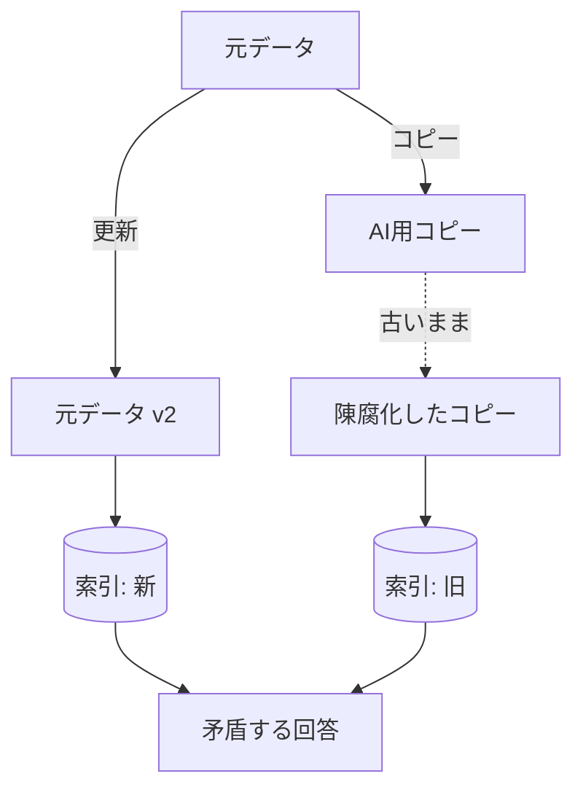
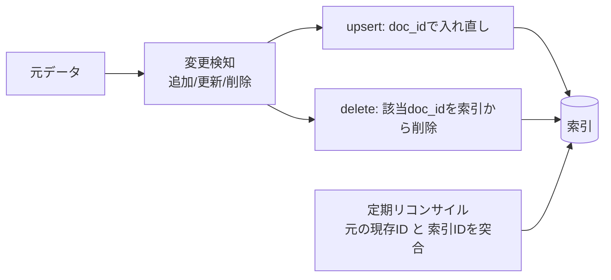

「AI に読ませるために、データを別の場所へコピーする」——
一見便利ですが、**重複と版ずれ**を生み、回答の矛盾や精度低下を招く代表的アンチパターンです。

## 何が起きるか

- 元が更新されてもコピーは古いまま → **古い情報で回答**
- 同じ内容が複数版で索引化 → **検索が割れて精度低下**
- どれが正本か不明 → **信頼性の喪失**

## 対策

| 対策 | 内容 |
| --- | --- |
| 参照を基本に | 複製せず元を参照（[データソース](/ai-tech-notes/data-sources/)） |
| Single Source of Truth | 正本を1つに定める（[バージョン管理](/ai-tech-notes/data-modeling/versioning/)） |
| 増分同期 | 元の更新/削除を索引へ伝播 |
| 重複排除 | 内容ハッシュで同一/類似を検出・統合 |
| 最新版のみ索引 | `version` / `updated_at` で旧版を除外 |

## 同期ジョブと失効ルールの基本パターン

「複製しない」が理想ですが、RAG では結局 **索引（コピーの一種）** を持ちます。
本質は **索引を元データに追従させ続ける**こと。どのソースでも共通する型は次の通りです。

- **安定した doc_id:** 元システムの**不変ID**を doc_id にする（パスや表示名は使わない）
- **upsert（冪等）:** 更新時は古いチャンクを delete してから入れ直す（重複防止・再実行安全）
- **削除の伝播（失効）:** 元の削除/アーカイブを検知し、該当 doc_id を索引から delete
- **リコンサイル（棚卸し）:** 取りこぼした削除を拾うため、定期的に「元の現存IDの集合」と「索引のID集合」を突合し、差分を削除
- **イベント駆動 or ポーリング:** Webhook で即時反映、または定期バッチで差分取得

### ソース別の変更検知（要点）

| ソース | 変更検知 | 削除検知 | 即時連携 | 安定キー |
| --- | --- | --- | --- | --- |
| SharePoint | Graph **delta クエリ** | delta の `deleted` ファセット | Graph 変更通知（webhook） | driveItem / list item の ID |
| Network File Server | 更新日時＋サイズ＋**内容ハッシュ**のマニフェスト比較 | 全列挙の差分（前回有・今回無→削除） | NTFS 変更ジャーナル(USN) / FileSystemWatcher | 内容ハッシュ（パスは不安定） |
| Confluence | CQL `lastmodified` ＋ `version.number` | 現存ページID と 索引IDの突合 | Confluence **webhook** | content id |

## ソース別の具体例

### SharePoint（Microsoft Graph）

- **delta クエリ:** ライブラリ/リストに `/delta` を発行し、前回の deltaLink トークン以降の
  **追加・更新・削除**をまとめて取得。削除は `deleted` ファセット付きで返るので、その ID の索引チャンクを delete。
- **バージョン:** アイテムにバージョン履歴がある → **最新版のみ索引**。`eTag` / `cTag` で内容変更を判定。
- **即時化:** Graph の変更通知（subscription / webhook）でニアリアルタイム同期。大規模では delta との併用が定番。
- **正本化:** 「この文書は SharePoint が正本」と決め、他所にはコピーではなく**リンク**を置く。

### Network File Server（SMB / Windows 共有）

変更フィードが無いのが難点で、自前の検知が必要です。

- **マニフェスト方式（一般的）:** `パス → (更新日時, サイズ, 内容ハッシュ)` を前回分として保存。
  クロールで差分を検出し、**消失したパス＝削除**として索引から delete。
- **NTFS 変更ジャーナル（USN Journal）/ FileSystemWatcher:** より即時・高度なイベント検知。
- **キー設計:** ファイルパスは改名・移動で変わり不安定。**内容ハッシュを doc_id** にすると移動に強く、
  重複排除も同時に効く（同一ハッシュ＝重複として1件に統合）。
- **正本化:** 可能なら一次情報を Confluence / SharePoint 等の管理された場所へ移し、ファイルサーバーは縮小する。

### Confluence

- **増分取得:** CQL（例 `lastmodified >= "2026/01/01 00:00"`）で更新ページのみ取得。`version.number` で版を判定し最新のみ索引。
- **削除/アーカイブ:** 削除が API で拾いにくい場合がある → スペース単位で**現存ページIDの集合**を取得し、
  索引のID集合と突合して差分を delete（リコンサイル）。ゴミ箱・アーカイブも反映。
- **即時化:** Confluence の **webhook**（page_created / updated / removed / trashed）でイベント駆動同期。
- **正本化:** Wiki を「手順・仕様の正本」と位置づけ、各所からはページに**リンク**（PDF 等で配り直さない）。

:::tip[共通の勘所]
**削除の取りこぼし**が最も多い失敗です。**イベント（webhook / delta）＋定期リコンサイル**の二重化で、
「消えた・古くなった情報が索引に残り続ける」状態を防ぎます。
:::

## チェックリスト

- [ ] AI 用に作ったコピーが更新追従できているか
- [ ] 元の削除が索引に反映されるか
- [ ] 同一内容が複数経路で二重に入っていないか

:::caution
やむを得ず複製する場合も、**同期ジョブと失効ルール**を必ずセットで設計してください。
:::
