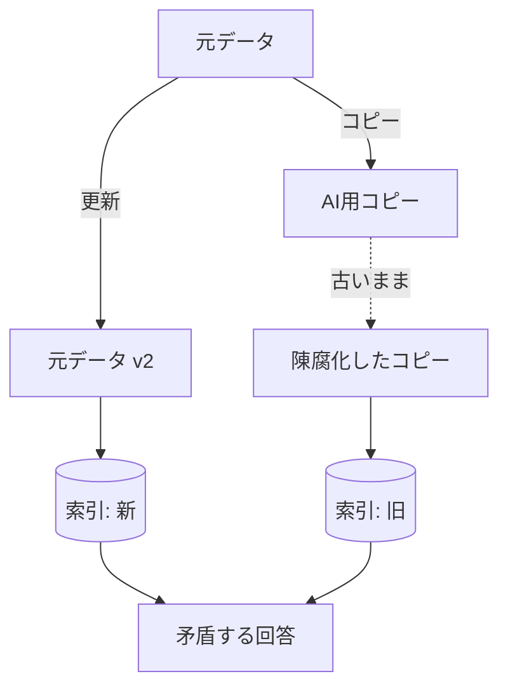

「AI に読ませるために、データを別の場所へコピーする」——
一見便利ですが、**重複と版ずれ**を生み、回答の矛盾や精度低下を招く代表的アンチパターンです。

## 何が起きるか

- 元が更新されてもコピーは古いまま → **古い情報で回答**
- 同じ内容が複数版で索引化 → **検索が割れて精度低下**
- どれが正本か不明 → **信頼性の喪失**

## 対策

| 対策 | 内容 |
| --- | --- |
| 参照を基本に | 複製せず元を参照（[データソース](/ai-tech-notes/data-sources/)） |
| Single Source of Truth | 正本を1つに定める（[バージョン管理](/ai-tech-notes/data-modeling/versioning/)） |
| 増分同期 | 元の更新/削除を索引へ伝播 |
| 重複排除 | 内容ハッシュで同一/類似を検出・統合 |
| 最新版のみ索引 | `version` / `updated_at` で旧版を除外 |

## チェックリスト

- [ ] AI 用に作ったコピーが更新追従できているか
- [ ] 元の削除が索引に反映されるか
- [ ] 同一内容が複数経路で二重に入っていないか

:::caution
やむを得ず複製する場合も、**同期ジョブと失効ルール**を必ずセットで設計してください。
:::
