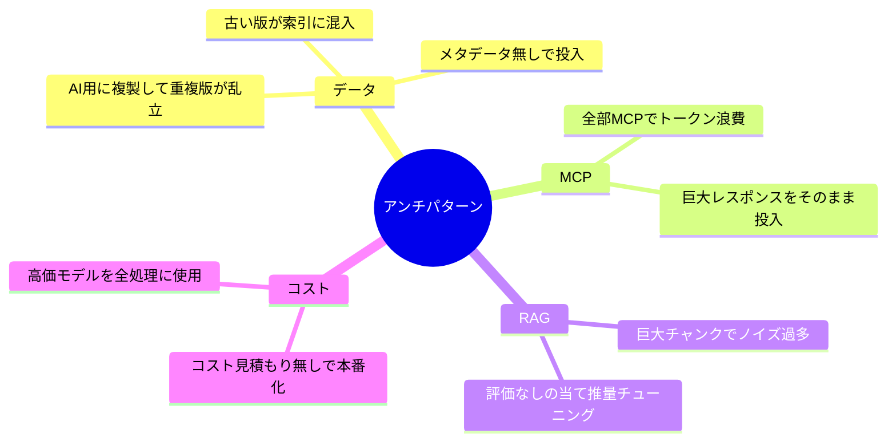

ナレッジ AI システムでよく見られる失敗パターンを集めます。
多くは **設計段階で回避可能** です。

## よくある失敗の地図

## 重点トピック

| アンチパターン | 影響 | 詳細 |
| --- | --- | --- |
| データ複製と重複バージョン | 精度低下・矛盾回答 | [詳細](/ai-tech-notes/anti-patterns/data-duplication/) |
| MCP トークン浪費 | コスト増・レイテンシ悪化 | [詳細](/ai-tech-notes/anti-patterns/mcp-token-waste/) |

## その他の注意（抜粋）

- メタデータ無しの投入 → 絞り込み不能（[メタデータ](/ai-tech-notes/data-modeling/metadata/)）
- 評価なしのチューニング → 改善が当て推量（[評価](/ai-tech-notes/rag/evaluation/)）
- 権限を無視した索引 → 情報漏えいリスク

:::note[今後追記]
組織・運用面のアンチパターン（オーナー不在など）を追加予定。
:::
