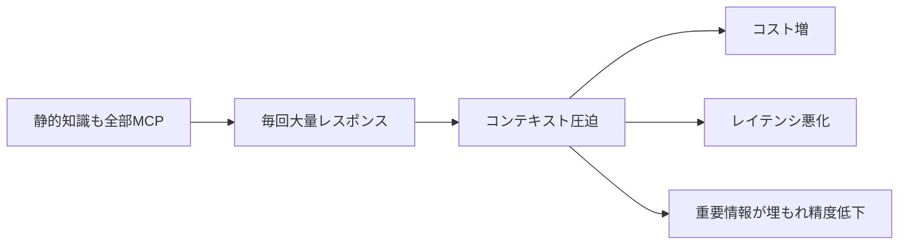

MCP は強力なため「**何でも MCP で取得**」しがちですが、
トークン消費が膨らみ、コスト・レイテンシ・精度すべてを悪化させます。
（基礎の対策は [トークン消費問題と対策](/ai-tech-notes/mcp/token-cost/)）

## 典型的な悪化パターン

## 回避策

| 症状 | 回避策 |
| --- | --- |
| 静的知識を毎回MCP取得 | RAG に寄せる（[使い分け](/ai-tech-notes/mcp/rag-vs-mcp/)） |
| 巨大レスポンス | サーバ側で要約・フィールド選択・件数制限 |
| ツールが多すぎる | 必要なツールだけ有効化 |
| 同じ取得の繰り返し | 結果をキャッシュ |

## 判断の目安

- **静的・大量** → RAG
- **動的・少量・最新性** → MCP（絞って取得）

:::tip
MCP のコストは「ツール定義 + レスポンス + 呼び出し回数」で効きます。3つすべてを絞るのが基本。
:::
