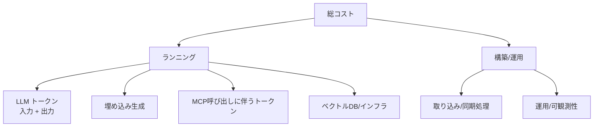

ROI を語る前に、まず **コストがどこで発生するか** を把握します。
トークン課金は「気づいたら高い」になりやすく、設計段階の見積もりが重要です。

## コストの内訳

## 効きやすいコスト要因

| 要因 | 影響 | 関連 |
| --- | --- | --- |
| 入力トークン量 | 投入文脈が大きいほど増 | [検索](/ai-tech-notes/rag/retrieval/) |
| MCP レスポンス | 肥大化で急増 | [MCPトークン対策](/ai-tech-notes/mcp/token-cost/) |
| モデル選択 | 高性能モデルは単価高 | [システム選定](/ai-tech-notes/cost-roi/system-selection/) |
| 呼び出し頻度 | 高頻度ユースケースで効く | [最適化](/ai-tech-notes/cost-roi/optimization/) |

## まず測る

- ユースケース別に **1リクエストあたりのトークン/コスト** を計測
- 可観測性（ログ）でコストを継続監視 → 異常の早期検知

## コスト試算テンプレート

新規システムや機能を本番化する前に、最低限この粒度で月額コストを見積もります。

| 項目 | 計算式 | 例 |
| --- | --- | --- |
| 月間リクエスト数 | DAU × 1人あたり回数 × 稼働日 | 200 × 5 × 20 = 20,000 |
| 平均入力トークン | プロンプト + RAGコンテキスト | 4,000 |
| 平均出力トークン | 回答の長さ | 800 |
| 入力コスト/月 | 月間req × 入力tok × 入力単価 | — |
| 出力コスト/月 | 月間req × 出力tok × 出力単価 | — |
| 埋め込みコスト | 取り込み文書量 × 埋め込み単価 | 初期＋増分 |
| インフラ（ベクトルDB等） | 月額固定 + 従量 | — |
| **合計（月額）** | 上記の総和 | — |

試算の精度を上げるコツ:

- **キャッシュ込みで見積もる** — プロンプトキャッシュが効く割合で入力コストは大きく変動（[最適化](/ai-tech-notes/cost-roi/optimization/)）
- **ピーク時**の同時実行数とレート上限も確認（コストだけでなく可用性に影響）
- 実トークン数は推測せず、サンプルで**実測**する（言語・コードで大きく変わる）

:::tip
最も効くのは **入力トークン量** であることが多いです。RAG で投入するコンテキストを絞るだけで、
リクエスト単価が大きく下がります → [検索とリランキング](/ai-tech-notes/rag/retrieval/)。
:::
