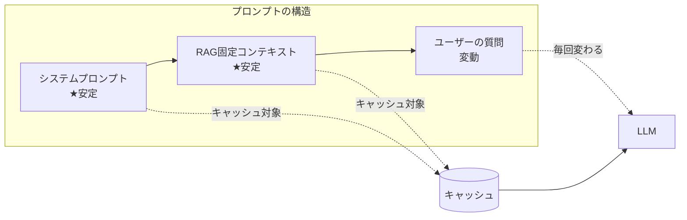
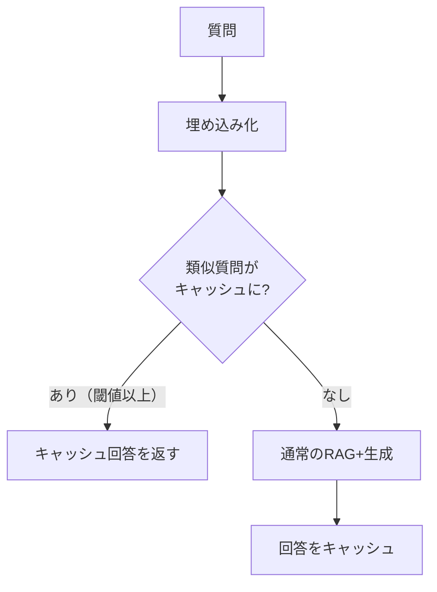
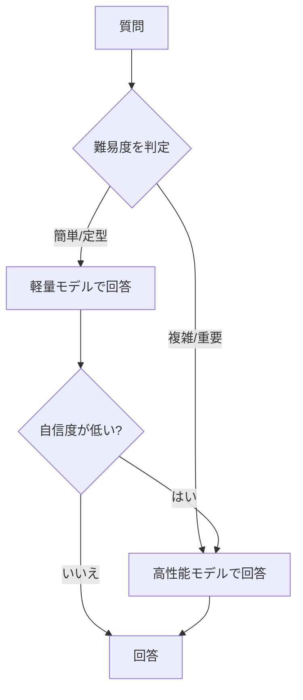
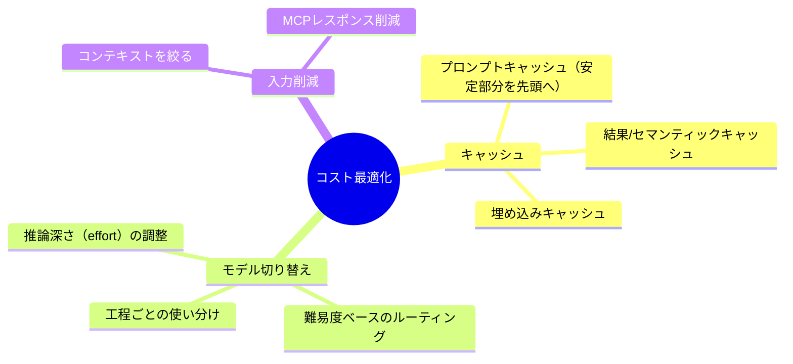

精度を落とさずにコストを下げるための実践的テクニックをまとめます。
特に効果が大きいのが **キャッシュの活用** と **モデルの適切な切り替え** です。

## 効果の大きい順に

| テクニック | 効果 | 関連 |
| --- | --- | --- |
| コンテキストを絞る | 入力トークン削減 | [検索とリランキング](/ai-tech-notes/rag/retrieval/) |
| プロンプトキャッシュ | 繰り返し入力の課金削減 | 本ページ下記 |
| 結果（セマンティック）キャッシュ | 同一・類似問い合わせの再計算回避 | 本ページ下記 |
| モデルの切り替え／ルーティング | 工程・難易度ごとに最適モデル | 本ページ下記 |
| MCPレスポンス削減 | 要約/フィールド選択 | [MCPトークン浪費](/ai-tech-notes/anti-patterns/mcp-token-waste/) |
| 増分同期 | 取り込みコスト削減 | [データソース](/ai-tech-notes/data-sources/) |

## 最適化の流れ

まず **支配的なコスト**から手を付けます（小さな項目の最適化は後回し）。そして
最適化のたびに [評価](/ai-tech-notes/rag/evaluation/) でスコアを確認し、**精度を犠牲にしない**ことが原則です。

---

## キャッシュの活用

ナレッジ AI では同じ文脈（システムプロンプト・RAG で固定的に投入する文書）や、
似た質問が繰り返されます。ここをキャッシュすると、精度を落とさずコストとレイテンシを下げられます。

### 1. プロンプトキャッシュ（入力トークンの再利用）

LLM への入力のうち、**毎回同じ前置き部分**をプロバイダ側でキャッシュさせ、
2回目以降は再計算を省く仕組みです。多くの実装が **プレフィックス一致**（先頭からの一致）で動作します。

設計の勘所（プレフィックス一致を効かせる）:

- **安定した内容を先頭に、変動する内容を後ろに置く**（システムプロンプト → 固定コンテキスト → 質問の順）
- 先頭に **日時・UUID・ユーザー名など毎回変わる値を入れない**（1バイトでも変わると以降のキャッシュが無効化）
- ツール定義やモデルを会話の途中で変えない（プレフィックスが崩れる）

経済性の目安（一般的なプロバイダの傾向）:

| 区分 | コスト感 | 備考 |
| --- | --- | --- |
| キャッシュ読み取り | 通常入力の **約 1/10** | 同じ前置きを再利用するほど得 |
| キャッシュ書き込み | 通常入力の **約 1.25 倍**（短期TTL） | 数回読まれれば元が取れる |
| 有効期限(TTL) | 数分〜1時間程度 | アクセス間隔に合わせて選ぶ |

:::tip[効いているか必ず計測する]
レスポンスのキャッシュ読み取りトークン（例: `cache_read` 系の指標）が **0 のまま**なら、
プレフィックスを毎回変えてしまう「サイレントな無効化」が起きています。
先頭に時刻やランダム値を入れていないか、JSON のキー順が安定しているかを確認します。
:::

### 2. 結果（セマンティック）キャッシュ

同じ・似た質問に対する **最終回答そのもの**をキャッシュして返す方式です。

- **完全一致キャッシュ:** 文字列が同一の質問に即座に回答（FAQ的な用途で強力）
- **セマンティックキャッシュ:** 質問の埋め込みが近ければキャッシュ回答を再利用（言い換えに対応）

注意点:

- 鮮度が重要なデータには使わない、または **TTL を短く**する（[最新性](/ai-tech-notes/mcp/rag-vs-mcp/)）
- 元文書が更新されたらキャッシュを失効させる（[バージョン管理](/ai-tech-notes/data-modeling/versioning/)）
- 閾値が緩いと「惜しいが間違った」回答を返すため、精度評価とセットで調整

### 3. 埋め込みキャッシュ

同じテキストの埋め込みは結果が決まっているため、**再計算せず保存して使い回す**のが基本です。
取り込み（インデックス更新）コストの削減に効きます → [増分同期](/ai-tech-notes/data-sources/)。

---

## モデルの適切な切り替え（ルーティング）

「すべての処理に最高性能モデルを使う」のは多くの場合オーバースペックです。
**工程・難易度に応じてモデルを使い分ける**ことで、品質を保ちつつ大きくコストを下げられます。

### A. 工程ごとの使い分け（パイプライン内）

1リクエストの内部でも、工程によって必要な知能は異なります。

| 工程 | 推奨 | 理由 |
| --- | --- | --- |
| 意図分類・ルーティング判定 | 軽量・安価モデル | 短い入出力・大量実行でコスト支配的 |
| 要約・抽出・整形 | 軽量〜標準モデル | 定型処理で十分な品質 |
| リランキング | 専用リランカ | 精度対コストが良い |
| 最終回答・ドラフト生成 | 高性能モデル | 品質が成果に直結 |

### B. 難易度ベースのルーティング（モデル階層）

まず軽量モデルで処理し、**難しい・自信がない場合だけ**高性能モデルにエスカレーションします。

| 階層 | 用途 | コスト感 |
| --- | --- | --- |
| 軽量（高速・安価） | FAQ、定型分類、一次処理 | 低 |
| 標準（バランス） | 一般的なナレッジ回答 | 中 |
| 高性能（高知能） | 複雑な推論・重要なドラフト/レビュー | 高 |

### C. 「考える量」を調整する

近年のモデルは推論の深さ（effort / thinking）を調整できます。
**簡単なタスクは浅く、難しいタスクだけ深く**することで、知能を保ちつつトークンを節約できます。

- 分類・要約など軽い処理 → 推論を浅く（または無効）
- 複雑な多段推論・レビュー → 推論を深く

:::caution[切り替え時の注意]
- **モデルを変えるとプロンプトキャッシュは無効化**されます（キャッシュはモデル単位）。
  会話の途中で頻繁に切り替えず、サブタスクは別呼び出しに分けるのが無難です。
- ルーティング判定自体のコスト・遅延が、節約分を上回らないようにします（判定は軽量に）。
- 切り替えで品質が落ちていないか、必ず [評価](/ai-tech-notes/rag/evaluation/) で確認します。
:::

---

## まとめ

:::tip
**キャッシュ活用 ＋ コンテキスト削減 ＋ モデルの使い分け** の3点で、多くの場合コストは大きく下がります。
いずれも「支配的コストから・精度を測りながら」が鉄則です。
:::
