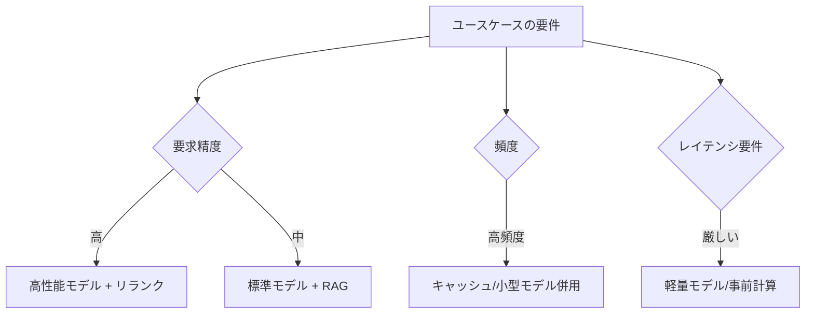

「最高性能を全処理に使う」のではなく、**ユースケースに見合った構成**を選ぶことが ROI を最大化します。

## 選定の判断軸

## モデル使い分け（段階処理）

| 工程 | 推奨 | 理由 |
| --- | --- | --- |
| 検索・分類・要約 | 小型/安価モデル | 大量処理・コスト支配的 |
| 最終回答生成 | 高性能モデル | 品質が成果に直結 |
| リランキング | 専用リランカ | 精度対コストが良い |

## ビルド vs バイ

- **マネージドサービス:** 立ち上げ速い・運用軽い / 単価とロックインに注意
- **セルフホスト:** 制御とコスト最適化が効く / 運用負荷大

## モデル選定の比較観点

単一モデルに固定せず、**用途ごとに階層を使い分ける**前提で評価します（詳細は
[モデルの切り替え](/ai-tech-notes/cost-roi/optimization/)）。

| 観点 | 軽量モデル | 標準モデル | 高性能モデル |
| --- | --- | --- | --- |
| 主な用途 | 分類・一次処理・FAQ | 一般的な回答 | 複雑な推論・重要なレビュー |
| 知能 | 低〜中 | 中〜高 | 高 |
| コスト | 低 | 中 | 高 |
| レイテンシ | 速い | 中 | 遅め |
| 選定の目安 | 大量・定型 | 既定の本命 | 難所のみ |

## ベクトルDBの選定観点

| 観点 | 確認すること |
| --- | --- |
| デプロイ形態 | マネージド / セルフホスト（運用負荷とコストのバランス） |
| スケール | 想定ベクトル件数・次元数に耐えるか |
| ハイブリッド検索 | ベクトル + キーワードを併用できるか（[検索](/ai-tech-notes/rag/retrieval/)） |
| メタデータフィルタ | 部署・期間などで絞れるか（[メタデータ](/ai-tech-notes/data-modeling/metadata/)） |
| 既存基盤との親和性 | 既存DBの拡張で足りないか（新規導入のコストを避けられる） |
| コスト構造 | ストレージ / クエリ / インデックス更新の課金 |

:::tip
まずは **既存のデータ基盤（RDBのベクトル拡張など）で要件を満たせないか**を検討すると、
新規コンポーネントの導入・運用コストを避けられる場合があります。
:::

## ROI の見方

- コスト（[コスト構造](/ai-tech-notes/cost-roi/)）に対し、**削減工数・品質向上**を定量化
- 小さく PoC →計測→拡大、の順で投資判断
