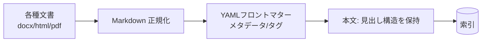

AI が高精度に扱えるかは、**データ形式の良し悪し**に大きく依存します。
本セクションでは、推奨フォーマット・メタデータ・タグ・バージョン管理を扱います。

## なぜ Markdown を推奨するか

| 観点 | Markdown の利点 |
| --- | --- |
| 構造 | 見出し階層がチャンク分割と相性が良い → [チャンク戦略](/ai-tech-notes/rag/chunking/) |
| 軽量 | ノイズが少なくトークン効率が良い |
| 差分管理 | Git で版管理・レビューしやすい |
| 移植性 | 各システムへの変換が容易 |

## 推奨するデータの形

## 原則

1. **一次情報を Markdown 中心に寄せる**（変換のたびに劣化させない）
2. **メタデータを必ず付ける** → [メタデータ](/ai-tech-notes/data-modeling/metadata/)
3. **タグ語彙を統制する** → [YAMLタグ](/ai-tech-notes/data-modeling/yaml-tags/)
4. **版を一意にする** → [バージョン管理](/ai-tech-notes/data-modeling/versioning/)

:::note[今後追記]
docx/pptx → Markdown 変換のツール比較を追加予定。
:::
