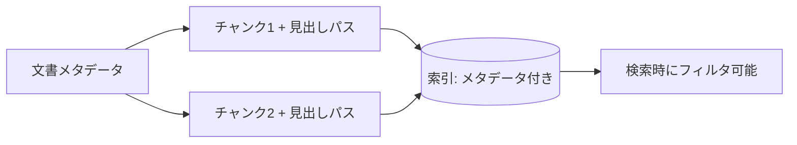

メタデータは **検索の絞り込み・権限制御・出典提示** を支える土台です。
本文だけを索引化すると「いつの・誰の・どの版か」が失われ、精度が落ちます。

## 最低限つけたいメタデータ

| フィールド | 用途 |
| --- | --- |
| `doc_id` / `source` | 出典の特定・原文への導線 |
| `title` | 表示・検索 |
| `updated_at` | 新しさでの絞り込み・並べ替え |
| `owner` / `team` | 権限・責任の所在 |
| `doc_type` | 種別フィルタ（仕様/手順/議事録 等） |
| `tags` | 主題での絞り込み → [YAMLタグ](/ai-tech-notes/data-modeling/yaml-tags/) |
| `version` / `status` | 最新版判定 → [バージョン管理](/ai-tech-notes/data-modeling/versioning/) |

## チャンクにもメタデータを継承する

- 文書メタデータをチャンクへ継承し、**見出しパス**（章/節）を追加すると出典提示が精密になる

:::note[今後追記]
メタデータスキーマの標準案（必須/任意）を追加予定。
:::
