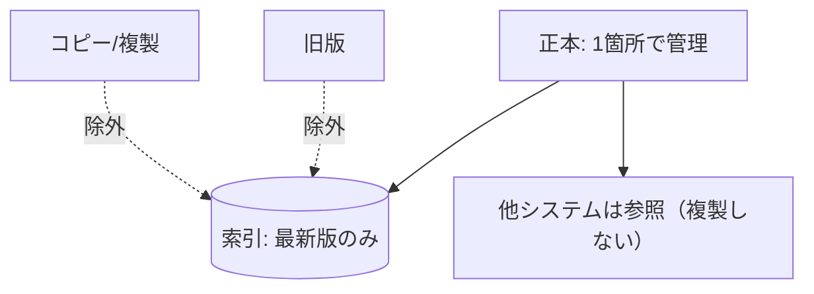

ナレッジ AI の精度低下で最も多い原因のひとつが、**古い版や複製が索引に混在**することです。
ここでは版を一意に保つ設計を扱います（落とし穴の詳細は
[アンチパターン](/ai-tech-notes/anti-patterns/data-duplication/)）。

## 原則: 一次情報は1つ（Single Source of Truth）

## 実装の勘所

| 施策 | 内容 |
| --- | --- |
| 正本の明示 | `status: published` / `canonical: true` で正本を識別 |
| 最新版のみ索引 | `version` / `updated_at` で最新だけを採用 |
| 重複排除 | 内容ハッシュで同一/類似を検出し統合 |
| 失効の伝播 | 元が更新/削除されたら索引も更新（増分同期） |
| 出典の一意化 | `source` URI で原文に一意に辿れる |

## チェックリスト

- [ ] 同一文書が複数ソースに重複していないか
- [ ] 旧版が検索に出てこないか
- [ ] 削除・アーカイブが索引に反映されるか

:::tip
「AI 用にデータを別の場所へコピー」は重複バージョン問題を生みます。**参照** を基本に。
:::
