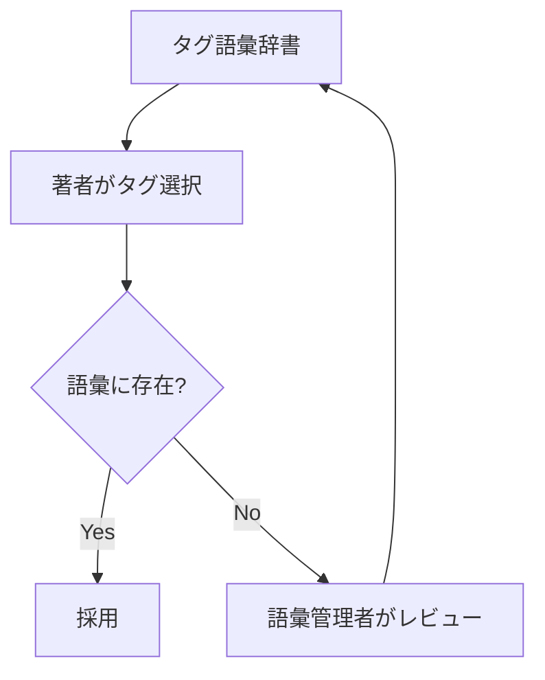

Markdown の **YAML フロントマター**にメタデータとタグを書くと、
人にも機械にも扱いやすい形でナレッジを構造化できます。

## フロントマターの例

```markdown
---
title: 出張申請の手順
doc_type: procedure
team: 総務
status: published
version: 3
updated_at: 2026-04-01
tags: [総務, 申請, ワークフロー]
source: confluence://SPACE/12345
---

本文（見出し構造を保ったまま）...
```

## タグ設計の原則

- **統制語彙（controlled vocabulary）:** 自由記述を避け、許可リストから選ぶ
- **粒度を揃える:** 「人事」「人事制度」「採用」が混在しないよう階層を決める
- **件数を絞る:** 1文書に多すぎるタグはノイズになる



## 注意

- 語彙を放置すると表記揺れで検索精度が落ちる → 定期的な棚卸し
- タグはメタデータフィルタ（[メタデータ](/ai-tech-notes/data-modeling/metadata/)）と連動させる

:::note[今後追記]
タグ語彙辞書のサンプルと運用フローを追加予定。
:::
