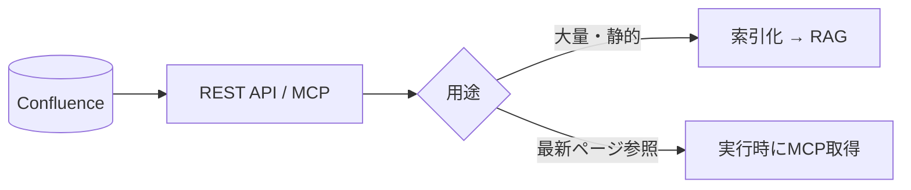

Confluence は Wiki・仕様・手順書の中心的な置き場です。
**ページ構造・ラベル・スペース**という良質なメタデータを持つのが強みです。

## 活用ポイント

- **スペース/ページ階層** をメタデータとして検索フィルタに使う
- **ラベル**を [タグ設計](/ai-tech-notes/data-modeling/yaml-tags/) に取り込む
- ページ本文は HTML → [Markdown 正規化](/ai-tech-notes/data-modeling/) して索引化

## 接続方式

| 方式 | 向くケース | 注意 |
| --- | --- | --- |
| バッチ索引 (RAG) | 全社Wikiの横断検索 | 増分同期が必要 |
| MCP / API | 特定ページの最新取得 | トークン消費に注意 |

## 注意

- 版管理が効くので、**最新版のみ索引** する（古い版を混ぜない）
- アーカイブ済みページの扱いを決める

:::note[今後追記]
Confluence REST/CQL での増分取得クエリ例を追加予定。
:::
