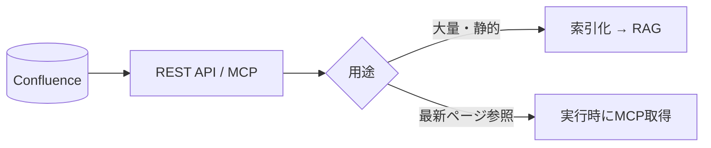

Confluence は Wiki・仕様・手順書の中心的な置き場です。
**ページ構造・ラベル・スペース**という良質なメタデータを持つのが強みです。

## 活用ポイント

- **スペース/ページ階層** をメタデータとして検索フィルタに使う
- **ラベル**を [タグ設計](/ai-tech-notes/data-modeling/yaml-tags/) に取り込む
- ページ本文は HTML → [Markdown 正規化](/ai-tech-notes/data-modeling/) して索引化

## 接続方式

| 方式 | 向くケース | 注意 |
| --- | --- | --- |
| バッチ索引 (RAG) | 全社Wikiの横断検索 | 増分同期が必要 |
| MCP / API | 特定ページの最新取得 | トークン消費に注意 |

## 注意

- 版管理が効くので、**最新版のみ索引** する（古い版を混ぜない）
- アーカイブ済みページの扱いを決める

## おすすめのデータ形式

Confluence は **良質なメタデータ（スペース・ラベル・階層）** を最初から持つのが強みです。

| 要素 | おすすめの扱い |
| --- | --- |
| ページ本文（HTML/ADF） | **Markdown 正規化**。見出し構造を保持 |
| 表 | 小さい表は **MD 表**、大きい/分析用は **CSV** |
| ラベル | [タグ](/ai-tech-notes/data-modeling/yaml-tags/) として取り込む |
| スペース・ページ階層 | 検索フィルタ用の **メタデータ** に |
| 添付（Office/PDF） | [File Server](/ai-tech-notes/data-sources/file-server/) と同様に抽出して MD/CSV 化 |

## アンチパターン

| アンチパターン | なぜダメか | 対策 |
| --- | --- | --- |
| マクロ・動的コンテンツ依存 | 静的テキスト化されず欠落する | 重要情報は本文テキストで持つ |
| 1ページに巨大な内容を詰める | チャンクが粗くなり精度低下 | ページ分割・見出しで構造化 |
| 図・表を画像添付のみで載せる | 索引に内容が入らない | テキスト/表で併記、代替テキスト |
| 旧版・下書きページが混在 | 古い情報で回答してしまう | 公開・最新（status）のみ索引 |
