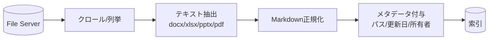

共有ファイルサーバ（SMB/Windows 共有）には Office 文書・PDF・図面などが蓄積されます。
**非構造データが多く、メタデータが乏しい**のが特徴です。

## 取り込みの流れ

## 勘所と注意

- **抽出品質がすべて:** スキャンPDFはOCRが必要。表・図は欠落しやすい
- **メタデータが薄い:** フォルダ構成・更新日・所有者を補助メタデータに使う
- **重複の温床:** `最終_v2_本当に最終.docx` 問題 → [重複対策](/ai-tech-notes/anti-patterns/data-duplication/)
- **権限:** NTFS/共有権限をインデックスのアクセス制御に反映

## 推奨

- 可能なら一次情報を [Markdown 中心](/ai-tech-notes/data-modeling/) の管理へ移行
- 増分クロール（更新日時ベース）でコスト削減

:::note[今後追記]
OCRパイプラインと、Office文書のテキスト抽出ライブラリ比較を追加予定。
:::
