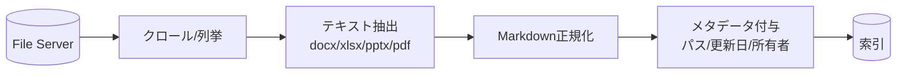

共有ファイルサーバ（SMB/Windows 共有）には Office 文書・PDF・図面などが蓄積されます。
**非構造データが多く、メタデータが乏しい**のが特徴です。

## 取り込みの流れ

## 勘所と注意

- **抽出品質がすべて:** スキャンPDFはOCRが必要。表・図は欠落しやすい
- **メタデータが薄い:** フォルダ構成・更新日・所有者を補助メタデータに使う
- **重複の温床:** `最終_v2_本当に最終.docx` 問題 → [重複対策](/ai-tech-notes/anti-patterns/data-duplication/)
- **権限:** NTFS/共有権限をインデックスのアクセス制御に反映

## 推奨

- 可能なら一次情報を [Markdown 中心](/ai-tech-notes/data-modeling/) の管理へ移行
- 増分クロール（更新日時ベース）でコスト削減

## おすすめのデータ形式

非構造データが多く、**変換の質がそのまま精度になる**のが File Server の特徴です。

| 元データ | おすすめの扱い |
| --- | --- |
| Word / PowerPoint（docx/pptx） | 見出し構造を保って **Markdown 化** |
| Excel（xlsx） | **CSV として抽出**。1行＝1レコードになるよう整形 |
| PDF（テキスト） | テキスト抽出 → Markdown 化 |
| 図面・スキャンPDF | OCR でテキスト化し、代替テキストを付与 |

- メタデータが薄いので、**フォルダ構成・ファイル名規約・更新日・所有者**を補助メタデータに変換する
- 中長期的には、頻繁に参照される一次情報を **Markdown ＋ メタデータ** で管理する形へ寄せると精度が安定

## アンチパターン

| アンチパターン | なぜダメか | 対策 |
| --- | --- | --- |
| `最終_v2_本当に最終.docx` | 重複版が索引に乱立し古い情報で回答 | 正本を1つに（[重複対策](/ai-tech-notes/anti-patterns/data-duplication/)） |
| Excel「方眼紙」・結合セル | 表が壊れ CSV 化できない | レイアウト用途をやめ、データ表に整形 |
| スキャンPDF（画像のみ） | テキストが無く検索不能 | OCR、可能なら原本を MD 化 |
| パスワード付き・独自バイナリ | テキスト抽出ができない | 解除・標準形式へ変換してから取り込む |
| フォルダ階層に意味を埋める | メタデータとして扱われない | 階層をタグ／メタデータへ写す |
