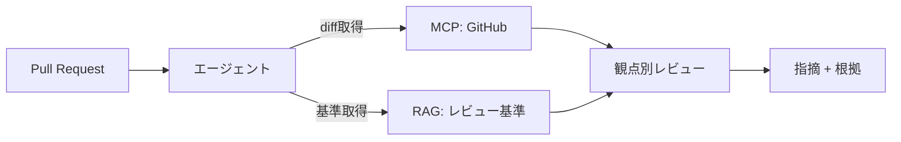

GitHub はコード・PR・Issue・ドキュメント（README/Markdown）の置き場です。
**コードレビュー支援**や開発ナレッジ回答で中心的な役割を果たします。

## 活用ポイント

- README / docs の Markdown は [そのまま RAG 索引](/ai-tech-notes/data-modeling/) に乗せやすい
- コード・PR・Issue は最新性が重要 → [MCP](/ai-tech-notes/mcp/) 経由の実行時取得
- [レビュー支援](/ai-tech-notes/use-cases/review-assist/) では差分（diff）と基準を組み合わせる

## 注意

- 大きな diff / ファイルはトークンを食う → 範囲を絞る
- private リポジトリの権限を尊重

## おすすめのデータ形式

GitHub は **Markdown ネイティブ**な場で、ナレッジ用途と最も相性が良いソースです。

| 要素 | おすすめの扱い |
| --- | --- |
| README / `docs/` | **Markdown** で集約（RAG に最良） |
| 設定・構造データ | **YAML / JSON** |
| 表データ | **CSV** |
| コード | そのまま＋パス/シンボルをメタデータに |
| 意思決定の記録 | **ADR（Markdown）** で残すと検索性が高い |
| PR / Issue | ラベル・本文(MD)をメタデータ兼根拠に |

## アンチパターン

| アンチパターン | なぜダメか | 対策 |
| --- | --- | --- |
| ドキュメントがコード内コメントだけ | 横断検索しづらい | `docs/` に Markdown で集約 |
| 生成物・巨大ファイルを索引 | ノイズとコストが増える | 対象を絞る／除外設定 |
| バイナリ（xlsx 等）をそのまま置く | diff も抽出も困難 | CSV / Markdown で持つ |
| 図を画像のみで載せる | 内容が索引に入らない | Mermaid 等テキスト図＋代替テキスト |

## 大きなデータの扱い

GitHub にはファイル/リポジトリのサイズ上限があります（目安）。

| 項目 | 代表的な上限（目安） |
| --- | --- |
| 1 ファイル | 50 MB 超で警告／**100 MB 超でブロック** |
| 大きなバイナリ/データセット | **Git LFS** の利用が前提 |
| リポジトリ全体 | 肥大化（数 GB〜）はパフォーマンス低下 |

- 大きな生成物・データセットは**索引対象から除外**（必要なら要約・サンプルのみ）
- 巨大 diff はレビュー時に**範囲を限定**して取得（[トークン対策](/ai-tech-notes/mcp/token-cost/)）
- API には**レート制限**があるため、増分取得＋バックオフで運用

:::note
上限値は変更されるため、実装前に GitHub の最新ドキュメントで確認してください。
:::
