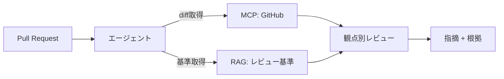

GitHub はコード・PR・Issue・ドキュメント（README/Markdown）の置き場です。
**コードレビュー支援**や開発ナレッジ回答で中心的な役割を果たします。

## 活用ポイント

- README / docs の Markdown は [そのまま RAG 索引](/ai-tech-notes/data-modeling/) に乗せやすい
- コード・PR・Issue は最新性が重要 → [MCP](/ai-tech-notes/mcp/) 経由の実行時取得
- [レビュー支援](/ai-tech-notes/use-cases/review-assist/) では差分（diff）と基準を組み合わせる

## 注意

- 大きな diff / ファイルはトークンを食う → 範囲を絞る
- private リポジトリの権限を尊重

:::note[今後追記]
PRレビューのプロンプト設計と、コード索引（シンボル単位）を追加予定。
:::
