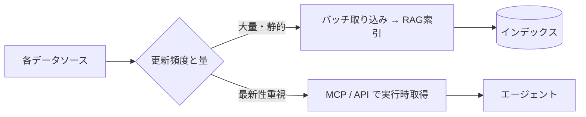
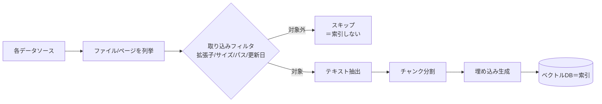

社内ナレッジは複数のシステムに分散しています。本セクションでは
**Microsoft 系を中心とした主要データソース**への接続戦略を整理します。
（Google Workspace 系は本サイトのスコープ外です）

## 対象データソース

| ソース | 主なコンテンツ | 接続方式の例 | 詳細 |
| --- | --- | --- | --- |
| Network File Server | Office文書・PDF・図面 | SMB/バッチ取り込み | [File Server](/ai-tech-notes/data-sources/file-server/) |
| Confluence | Wiki・仕様・手順 | REST API / MCP | [Confluence](/ai-tech-notes/data-sources/confluence/) |
| JIRA | チケット・要件・履歴 | REST API / MCP | [JIRA](/ai-tech-notes/data-sources/jira/) |
| GitHub | コード・PR・Issue | API / MCP | [GitHub](/ai-tech-notes/data-sources/github/) |
| SharePoint | 文書・社内ポータル | Graph API / MCP | [SharePoint](/ai-tech-notes/data-sources/sharepoint/) |

## 接続戦略の基本



## 横断的に押さえる点

- **権限の継承:** 元システムのアクセス権を回答にも反映する
- **重複の排除:** 同じ文書が複数ソースに存在しうる → [重複対策](/ai-tech-notes/anti-patterns/data-duplication/)
- **正規化:** 取り込み後は [Markdown 等に正規化](/ai-tech-notes/data-modeling/) して扱う
- **増分更新:** 変更分のみ再取り込みしてコストを抑える

## 理想的なデータ形式（MD / CSV / メタデータ）

AI が高精度に扱えるかは、保存されている **データ形式** に大きく依存します。
形式選びの基本方針は次の通りです。

| コンテンツ種別 | 推奨形式 | 理由 |
| --- | --- | --- |
| 文章・手順・仕様・FAQ | **Markdown** | 見出し構造が[チャンク](/ai-tech-notes/rag/chunking/)と相性◎・軽量・差分管理しやすい |
| 表・一覧・マスタ・設定値 | **CSV**（または整形された表） | 「1行＝1レコード」で意味が明確・構造化検索しやすい |
| 厳密な構造データ・設定 | JSON / YAML | スキーマがあり機械処理に向く |
| （上記すべてに）付帯情報 | **＋メタデータ** | 出典・更新日・権限・タグで絞り込みと出典提示が効く |

- **Markdown は RAG の第一選択**（→ [データ形式の方針](/ai-tech-notes/data-modeling/)）。ノイズが少なく、見出しで分割できる。
- **表データは CSV** が扱いやすい。ただし RAG では **ヘッダ＋値の対応（1行＝1レコード）** を保てる形に整えることが重要。巨大表の丸投げは精度を落とす。
- **メタデータは形式を問わず付与**（→ [メタデータ](/ai-tech-notes/data-modeling/metadata/) / [YAMLタグ](/ai-tech-notes/data-modeling/yaml-tags/)）。

### ソース別の「効きどころ」早見表

| ソース | Markdown | CSV / 表 | メタデータの源泉 |
| --- | --- | --- | --- |
| File Server | Office → MD 化 | Excel → CSV 抽出 | フォルダ/更新日/所有者（薄い→補完が必要） |
| Confluence | ページ → MD | 表 → MD表/CSV | スペース/ラベル/階層（良質） |
| JIRA | 説明・コメント = MD | エクスポート CSV | フィールド（最良・構造化済み） |
| GitHub | README/docs = MD（最良） | 設定=YAML/JSON・データ=CSV | パス/リポジトリ/PR・Issue ラベル |
| SharePoint | Office → MD 化 | リスト → CSV/構造化 | ライブラリの列（良質） |

### 横断アンチパターン

| アンチパターン | なぜダメか | 対策 |
| --- | --- | --- |
| スキャンPDF（画像）を丸ごと投入 | テキストが無く検索不能 | OCR、可能なら原本を MD 化 |
| Excel「方眼紙」/結合セル | 行＝レコードにならず表が壊れる | データ表に整形し CSV へ |
| 図表を画像で貼る（テキスト化なし） | 内容が索引に入らない | 代替テキスト・表（MD/CSV）で併記 |
| メタデータ無しで丸投げ | 絞り込み・出典提示ができない | 取り込み時に付与 |
| 巨大な単一ファイル | チャンクが粗くノイズ増 | 適切に分割（[チャンク戦略](/ai-tech-notes/rag/chunking/)） |

### 大きなデータ・容量の扱い（共通）

各ストレージには **ファイルサイズ・件数・記憶域の上限**があり、大規模データはそのまま扱えません。
データ特性に応じて「丸ごと」ではなく**絞って**取り込むのが原則です。

- 巨大ファイルは**丸ごと索引化せず**、テキスト抽出・要約・必要部分のみを索引に
- 動画・画像・スキャンは**文字起こし／OCR／代替テキスト**でテキスト化
- 全件スキャンを避け、**増分同期 ＋ ページング**で取得
- **サイズ/件数の閾値**で取り込み対象を線引きする

ソース別の代表的な上限（目安、変更されるため最新の公式ドキュメントで確認）:

| ソース | 効いてくる上限の例 |
| --- | --- |
| SharePoint | リストビュー **5,000 アイテム**、1ファイル約 250 GB、サイト約 25 TB |
| GitHub | 1ファイル **100 MB でブロック**（大物は Git LFS）、API レート制限 |
| Confluence / JIRA | 添付サイズ上限（環境依存）、検索結果のページング上限 |
| File Server | 実質ストレージ次第だが、動画・CAD 等の巨大ファイルに注意 |

## 補足: 「索引から外す」とは具体的に何をするのか

本セクションでは「索引から外す」「取り込み対象外」といった表現が頻出します。
これらが具体的にどんな処理を指すのかを補足します。

### 前提: 「インデックス（索引）」と「取り込み」

RAG が検索できるようにするには、元データを次の順で処理して**ベクトル DB に保存**します。
この一連の処理を **取り込み（ingestion）** と呼びます。



つまり **「索引」＝検索対象として DB に入っている状態**、
**「索引から外す／取り込み対象外」＝この取り込みの入口フィルタで弾き、抽出も埋め込みも保存もしない（＝何もしない）** ことです。

### どうやって「外す」のか（取り込み前のフィルタ）

取り込みジョブに**除外ルール**を設定します。代表的な条件:

- **拡張子 / 種別（MIME）**: `.zip` `.mp4` `.iso` `.dwg` など非対象を弾く
- **ファイルサイズ**: 例「25 MB を超えるものは取り込まない」
- **パス / フォルダ**: `**/_archive/**` `**/old/**` などを除外
- **更新日**: 「5 年より古い文書は対象外」（任意）
- **命名規則 / メタデータ・ラベル**: `下書き` 状態などを除外

設定のイメージ（擬似的な取り込み設定ファイル）:

```yaml
ingest:
  include:
    extensions: [.md, .docx, .pdf, .csv, .txt]
  exclude:
    extensions: [.zip, .mp4, .iso, .dwg]   # 動画・バイナリは索引しない
    max_size_mb: 25                          # これを超えるファイルは取り込まない
    path_globs: ["**/_archive/**", "**/old/**"]
    status_not_in: ["draft"]                 # 下書きは除外
  transform:
    extract_text: true        # docx/pdf 等から本文を抽出
    ocr: true                 # 画像PDFはOCRでテキスト化
    summarize_over_tokens: 8000  # 長すぎる文書は要約してから索引
```

### すでに索引済みのものを「外す」場合

一度入れたものを外す／元が削除された場合は、**ベクトル DB から該当ドキュメントを削除**します。

- 各チャンクに `doc_id`（[メタデータ](/ai-tech-notes/data-modeling/metadata/)）を持たせておく
- 除外ルールに該当・元が削除/更新 → その `doc_id` のチャンクを **DB から delete**（更新時は delete してから入れ直し）
- これを定期ジョブで回すのが **失効同期**（[重複・バージョン対策](/ai-tech-notes/anti-patterns/data-duplication/)）

### 用語の対応表（曖昧な表現 → 具体的な処理）

| 本文中の表現 | 具体的に行うこと |
| --- | --- |
| 索引から外す / 取り込み対象外 | 取り込みフィルタでスキップ（抽出も保存もしない） |
| テキスト抽出 | docx/pdf/xlsx 等から本文テキスト（MD/CSV）を取り出す |
| 要約してから索引 | 抽出後、長文を LLM で要約し、その要約をチャンク・埋め込み |
| 文字起こし / OCR | 動画・音声→文字起こし、画像PDF→OCR でテキスト化 |
| 増分同期 / ページング | 変更分のみ再取り込み（更新日時/delta）・分割取得 |
| 失効（元の削除を反映） | 元の削除/更新を検知し、該当 `doc_id` を DB から削除/入れ直し |

各ソースの具体的な推奨形式・アンチパターン・容量の扱いは、それぞれの個別ページにまとめています。
