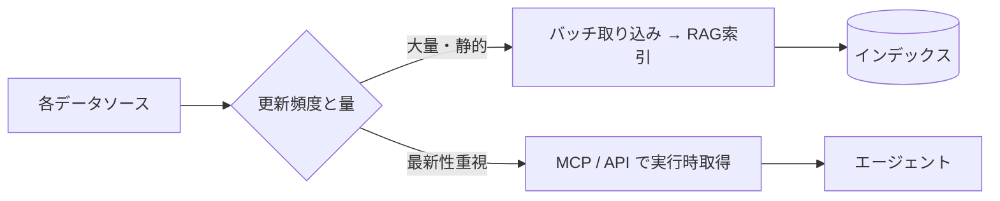

社内ナレッジは複数のシステムに分散しています。本セクションでは
**Microsoft 系を中心とした主要データソース**への接続戦略を整理します。
（Google Workspace 系は本サイトのスコープ外です）

## 対象データソース

| ソース | 主なコンテンツ | 接続方式の例 | 詳細 |
| --- | --- | --- | --- |
| Network File Server | Office文書・PDF・図面 | SMB/バッチ取り込み | [File Server](/ai-tech-notes/data-sources/file-server/) |
| Confluence | Wiki・仕様・手順 | REST API / MCP | [Confluence](/ai-tech-notes/data-sources/confluence/) |
| JIRA | チケット・要件・履歴 | REST API / MCP | [JIRA](/ai-tech-notes/data-sources/jira/) |
| GitHub | コード・PR・Issue | API / MCP | [GitHub](/ai-tech-notes/data-sources/github/) |
| SharePoint | 文書・社内ポータル | Graph API / MCP | [SharePoint](/ai-tech-notes/data-sources/sharepoint/) |

## 接続戦略の基本

## 横断的に押さえる点

- **権限の継承:** 元システムのアクセス権を回答にも反映する
- **重複の排除:** 同じ文書が複数ソースに存在しうる → [重複対策](/ai-tech-notes/anti-patterns/data-duplication/)
- **正規化:** 取り込み後は [Markdown 等に正規化](/ai-tech-notes/data-modeling/) して扱う
- **増分更新:** 変更分のみ再取り込みしてコストを抑える

:::note[今後追記]
各ソースの認証方式・レート制限・増分同期の実装メモを追加予定。
:::
