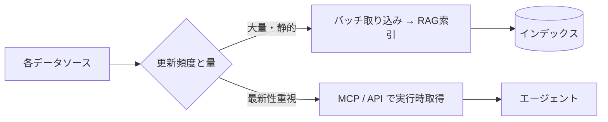

社内ナレッジは複数のシステムに分散しています。本セクションでは
**Microsoft 系を中心とした主要データソース**への接続戦略を整理します。
（Google Workspace 系は本サイトのスコープ外です）

## 対象データソース

| ソース | 主なコンテンツ | 接続方式の例 | 詳細 |
| --- | --- | --- | --- |
| Network File Server | Office文書・PDF・図面 | SMB/バッチ取り込み | [File Server](/ai-tech-notes/data-sources/file-server/) |
| Confluence | Wiki・仕様・手順 | REST API / MCP | [Confluence](/ai-tech-notes/data-sources/confluence/) |
| JIRA | チケット・要件・履歴 | REST API / MCP | [JIRA](/ai-tech-notes/data-sources/jira/) |
| GitHub | コード・PR・Issue | API / MCP | [GitHub](/ai-tech-notes/data-sources/github/) |
| SharePoint | 文書・社内ポータル | Graph API / MCP | [SharePoint](/ai-tech-notes/data-sources/sharepoint/) |

## 接続戦略の基本

## 横断的に押さえる点

- **権限の継承:** 元システムのアクセス権を回答にも反映する
- **重複の排除:** 同じ文書が複数ソースに存在しうる → [重複対策](/ai-tech-notes/anti-patterns/data-duplication/)
- **正規化:** 取り込み後は [Markdown 等に正規化](/ai-tech-notes/data-modeling/) して扱う
- **増分更新:** 変更分のみ再取り込みしてコストを抑える

## 理想的なデータ形式（MD / CSV / メタデータ）

AI が高精度に扱えるかは、保存されている **データ形式** に大きく依存します。
形式選びの基本方針は次の通りです。

| コンテンツ種別 | 推奨形式 | 理由 |
| --- | --- | --- |
| 文章・手順・仕様・FAQ | **Markdown** | 見出し構造が[チャンク](/ai-tech-notes/rag/chunking/)と相性◎・軽量・差分管理しやすい |
| 表・一覧・マスタ・設定値 | **CSV**（または整形された表） | 「1行＝1レコード」で意味が明確・構造化検索しやすい |
| 厳密な構造データ・設定 | JSON / YAML | スキーマがあり機械処理に向く |
| （上記すべてに）付帯情報 | **＋メタデータ** | 出典・更新日・権限・タグで絞り込みと出典提示が効く |

- **Markdown は RAG の第一選択**（→ [データ形式の方針](/ai-tech-notes/data-modeling/)）。ノイズが少なく、見出しで分割できる。
- **表データは CSV** が扱いやすい。ただし RAG では **ヘッダ＋値の対応（1行＝1レコード）** を保てる形に整えることが重要。巨大表の丸投げは精度を落とす。
- **メタデータは形式を問わず付与**（→ [メタデータ](/ai-tech-notes/data-modeling/metadata/) / [YAMLタグ](/ai-tech-notes/data-modeling/yaml-tags/)）。

### ソース別の「効きどころ」早見表

| ソース | Markdown | CSV / 表 | メタデータの源泉 |
| --- | --- | --- | --- |
| File Server | Office → MD 化 | Excel → CSV 抽出 | フォルダ/更新日/所有者（薄い→補完が必要） |
| Confluence | ページ → MD | 表 → MD表/CSV | スペース/ラベル/階層（良質） |
| JIRA | 説明・コメント = MD | エクスポート CSV | フィールド（最良・構造化済み） |
| GitHub | README/docs = MD（最良） | 設定=YAML/JSON・データ=CSV | パス/リポジトリ/PR・Issue ラベル |
| SharePoint | Office → MD 化 | リスト → CSV/構造化 | ライブラリの列（良質） |

### 横断アンチパターン

| アンチパターン | なぜダメか | 対策 |
| --- | --- | --- |
| スキャンPDF（画像）を丸ごと投入 | テキストが無く検索不能 | OCR、可能なら原本を MD 化 |
| Excel「方眼紙」/結合セル | 行＝レコードにならず表が壊れる | データ表に整形し CSV へ |
| 図表を画像で貼る（テキスト化なし） | 内容が索引に入らない | 代替テキスト・表（MD/CSV）で併記 |
| メタデータ無しで丸投げ | 絞り込み・出典提示ができない | 取り込み時に付与 |
| 巨大な単一ファイル | チャンクが粗くノイズ増 | 適切に分割（[チャンク戦略](/ai-tech-notes/rag/chunking/)） |

各ソースの具体的な推奨形式・アンチパターンは、それぞれの個別ページにまとめています。
