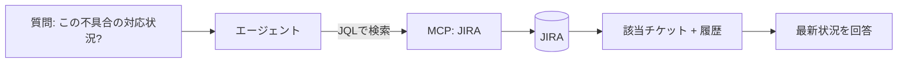

JIRA はチケット（課題）・要件・対応履歴が蓄積される **構造化データ** の宝庫です。
最新の状態が重要なため、**MCP / API での実行時取得**が向きます。

## 特徴と使い分け

- フィールド（ステータス・担当・優先度）が豊富 → 構造化クエリ（JQL）で絞れる
- 状態が変わり続ける → 静的索引より [MCP](/ai-tech-notes/mcp/) 経由の実行時取得が基本
- 過去の解決事例は RAG 索引に向くこともある（静的化できる範囲）

## 注意

- レスポンスが大きくなりがち → サーバ側で **フィールド選択・件数制限** → [トークン対策](/ai-tech-notes/mcp/token-cost/)
- 権限（プロジェクト単位）を尊重

## おすすめのデータ形式

JIRA の最大の資産は **構造化されたフィールド** です。本文をどう持つかよりも、
**フィールドをメタデータとして活かす**ことが効果的です。

| 要素 | おすすめの扱い |
| --- | --- |
| フィールド（状態/担当/優先度/種別/コンポーネント） | そのまま **メタデータ** に。JQL での絞り込みに直結 |
| 説明・コメント本文 | **Markdown** として扱う（記法を保持） |
| 一覧・集計 | **CSV エクスポート**で参照表・分析に活用 |
| 過去の解決事例（静的化できるもの） | MD 化して RAG 索引にも載せる |

## アンチパターン

| アンチパターン | なぜダメか | 対策 |
| --- | --- | --- |
| 説明欄に表やログをスクショで貼る | テキスト化されず検索不能 | テキスト/コードブロック/CSV で貼る |
| 重要情報を長い自由記述に埋める | 抽出・絞り込みがしづらい | フィールド化＋要約を併記 |
| 巨大な添付を丸ごと投入 | トークンを浪費する | 必要部分を抽出（[トークン対策](/ai-tech-notes/mcp/token-cost/)） |
| 古い解決済み課題を無条件に索引 | ノイズ・古い情報 | 期間・状態で絞る |

## 大きなデータの扱い

- 添付にはサイズ上限があり、巨大ログ/ダンプは不向き → 要点を抽出して持つ
- 検索結果は **ページング（最大件数）** で取得し、一度に大量取得しない
- 長大な説明・コメント履歴は**要約**してから投入（[トークン対策](/ai-tech-notes/mcp/token-cost/)）
- プロジェクト横断の全件取得は避け、**JQL で対象を絞る**＋増分取得
