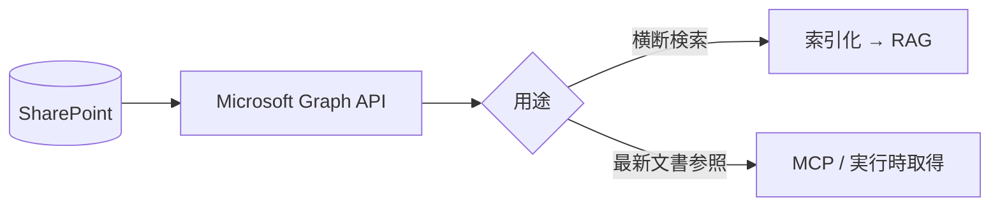

SharePoint（および OneDrive for Business）は、社内ポータル・文書ライブラリの中心です。
**Microsoft Graph API** 経由でアクセスでき、メタデータ列を活用できます。

## 活用ポイント

- **ドキュメントライブラリの列（メタデータ）** を検索フィルタに使う
- Office 文書はテキスト抽出 → [Markdown 正規化](/ai-tech-notes/data-modeling/)
- サイト/ライブラリ単位の権限を尊重（Graph の権限モデル）

## 注意

- 大規模テナントでは **増分同期（delta クエリ）** が必須
- バージョン履歴があるため **最新版のみ索引**（[重複対策](/ai-tech-notes/anti-patterns/data-duplication/)）
- スロットリング（レート制限）に注意

## おすすめのデータ形式

SharePoint は **ドキュメントライブラリの列（メタデータ）** が強力です。形式変換に加え、
この列をどれだけ活かすかで検索精度が変わります。

| 要素 | おすすめの扱い |
| --- | --- |
| ライブラリの列（部署/種別/レビュー状態 等） | そのまま **メタデータ**（検索フィルタの軸） |
| Office 文書 | 構造を保って **Markdown 化** |
| SharePoint リスト | **CSV / 構造化データ**として取り込む |
| 図・表 | 代替テキスト・表（MD/CSV）で併記 |

## アンチパターン

| アンチパターン | なぜダメか | 対策 |
| --- | --- | --- |
| Excel「方眼紙」・結合セル | 表が壊れて構造化できない | データ表に整形し CSV へ |
| メタデータ列を未設定/未活用 | 絞り込みが効かない | 必須列を定義し運用ルール化 |
| フォルダ階層に意味を埋める | メタデータとして扱われない | 列（メタデータ）へ移す |
| バージョン履歴を区別せず索引 | 古い版が混ざり精度低下 | 最新版のみ索引 |
