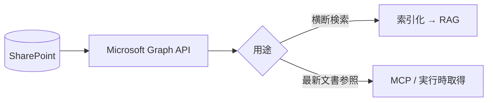

SharePoint（および OneDrive for Business）は、社内ポータル・文書ライブラリの中心です。
**Microsoft Graph API** 経由でアクセスでき、メタデータ列を活用できます。

## 活用ポイント

- **ドキュメントライブラリの列（メタデータ）** を検索フィルタに使う
- Office 文書はテキスト抽出 → [Markdown 正規化](/ai-tech-notes/data-modeling/)
- サイト/ライブラリ単位の権限を尊重（Graph の権限モデル）

## 注意

- 大規模テナントでは **増分同期（delta クエリ）** が必須
- バージョン履歴があるため **最新版のみ索引**（[重複対策](/ai-tech-notes/anti-patterns/data-duplication/)）
- スロットリング（レート制限）に注意

## おすすめのデータ形式

SharePoint は **ドキュメントライブラリの列（メタデータ）** が強力です。形式変換に加え、
この列をどれだけ活かすかで検索精度が変わります。

| 要素 | おすすめの扱い |
| --- | --- |
| ライブラリの列（部署/種別/レビュー状態 等） | そのまま **メタデータ**（検索フィルタの軸） |
| Office 文書 | 構造を保って **Markdown 化** |
| SharePoint リスト | **CSV / 構造化データ**として取り込む |
| 図・表 | 代替テキスト・表（MD/CSV）で併記 |

## アンチパターン

| アンチパターン | なぜダメか | 対策 |
| --- | --- | --- |
| Excel「方眼紙」・結合セル | 表が壊れて構造化できない | データ表に整形し CSV へ |
| メタデータ列を未設定/未活用 | 絞り込みが効かない | 必須列を定義し運用ルール化 |
| フォルダ階層に意味を埋める | メタデータとして扱われない | 列（メタデータ）へ移す |
| バージョン履歴を区別せず索引 | 古い版が混ざり精度低下 | 最新版のみ索引 |

## 容量・上限と大きなデータの扱い

SharePoint Online には複数の上限があり、**大規模ライブラリでは取り込み設計に直結**します。

| 項目 | 代表的な上限（目安） |
| --- | --- |
| 1 ファイルの最大サイズ | 約 250 GB |
| ライブラリ/リストのアイテム数 | 最大 約 3,000 万 |
| **リストビューのしきい値** | **5,000 アイテム**（一度に列挙/フィルタできる上限） |
| サイトの記憶域 | 最大 約 25 TB／サイト |
| テナント全体の記憶域 | 1 TB ＋（ライセンスユーザー数 × 10 GB）＋購入分 |

:::caution[最大の落とし穴は「5,000 アイテムのしきい値」]
5,000 件を超えるライブラリを素朴に列挙・フィルタするとエラーになります。
**インデックス列でのフィルタ**と**ページング**が前提です。
:::

大きなデータを扱う際の指針:

- **増分同期（delta クエリ）** で全件スキャンを避ける
- 取得は**ページング**し、**インデックス列**でフィルタして 5,000 しきい値を回避
- 大容量ファイル（動画・大きな PDF・CAD など）は**本文を丸ごと索引化せず**、テキスト/要約のみ抽出（動画は文字起こし）
- **サイズ閾値で取り込み対象外**にするフィルタを設ける
- スロットリング（レート制限）に備え、バックオフ＋夜間バッチで取り込む

:::note
上限値はサービス更新で変わります。実装前に Microsoft の最新公式ドキュメントで必ず確認してください。
:::
