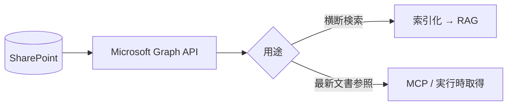

SharePoint（および OneDrive for Business）は、社内ポータル・文書ライブラリの中心です。
**Microsoft Graph API** 経由でアクセスでき、メタデータ列を活用できます。

## 活用ポイント

- **ドキュメントライブラリの列（メタデータ）** を検索フィルタに使う
- Office 文書はテキスト抽出 → [Markdown 正規化](/ai-tech-notes/data-modeling/)
- サイト/ライブラリ単位の権限を尊重（Graph の権限モデル）

## 注意

- 大規模テナントでは **増分同期（delta クエリ）** が必須
- バージョン履歴があるため **最新版のみ索引**（[重複対策](/ai-tech-notes/anti-patterns/data-duplication/)）
- スロットリング（レート制限）に注意

:::note[今後追記]
Graph の delta クエリと、権限トリミングの実装メモを追加予定。
:::
