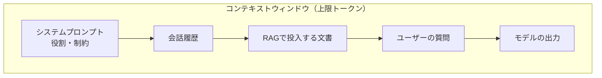
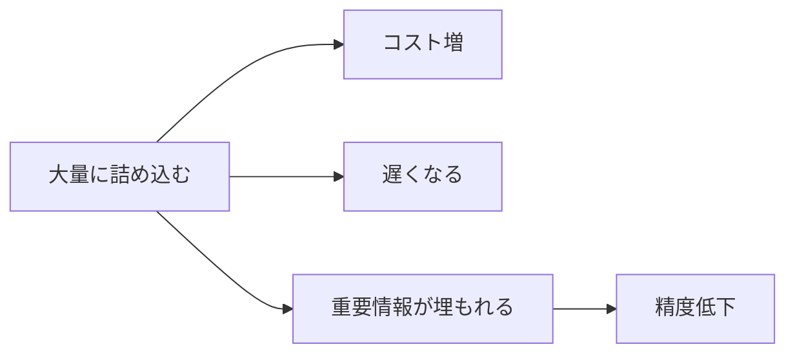

**コンテキストウィンドウ（context window）** は、LLM が **一度のリクエストで扱える
トークンの上限**です。システムプロンプト・会話履歴・RAG で投入する文書・そして出力まで、
すべてがこの「窓」を共有します。

## 窓の中身

入力（システム＋履歴＋文書＋質問）と出力の **合計**が上限に収まる必要があります。
出力用の余白も残しておく点に注意します。

## 上限を超える・近づくと何が起きるか

| 状況 | 起きること | 対策 |
| --- | --- | --- |
| 上限を超える | エラー、または古い履歴が脱落 | 要約・圧縮、投入量を絞る |
| 詰め込みすぎ | コスト増・レイテンシ悪化・精度低下 | 必要な文書だけに限定 |
| 長文の中盤 | 中央の情報が軽視されやすい（lost in the middle） | 重要情報を前後に配置、件数を絞る |

## 「大きい窓」は万能ではない

近年は非常に大きなコンテキストウィンドウを持つモデルもありますが、
**大量に入れれば精度が上がるわけではありません**。むしろノイズが増えると精度は下がりがちです。

- **必要な分だけ**を入れる（RAG で関連文書を厳選 → [検索とリランキング](/ai-tech-notes/rag/retrieval/)）
- 長い会話は **要約・圧縮**して履歴を圧縮する
- 静的・大量の知識は窓に詰めず [RAG](/ai-tech-notes/rag/) に逃がす

:::tip
「コンテキストウィンドウが大きい ＝ 全部入れてよい」ではありません。
**入れる量とコスト・精度はトレードオフ**です（→ [コスト最適化](/ai-tech-notes/cost-roi/optimization/)）。
:::
