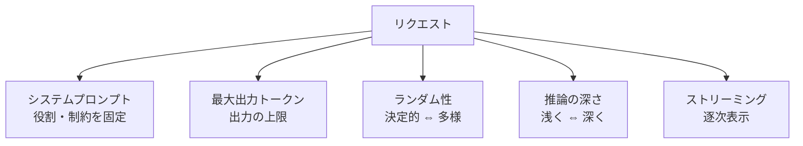
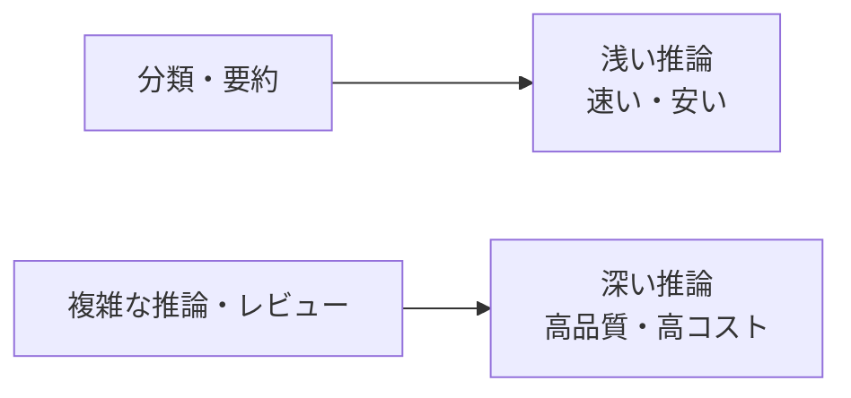

LLM の振る舞いは、いくつかの基本パラメータで調整できます。
ここを理解しておくと、品質・コスト・体感速度のバランスを取りやすくなります。

## 主な制御パラメータ

### 1. システムプロンプト

モデルの **役割・トーン・制約**を最初に固定する指示です。
「出典を必ず示す」「不明なら不明と答える」など、ナレッジ回答の品質を支える要になります。
内容を安定させると [プロンプトキャッシュ](/ai-tech-notes/cost-roi/optimization/) も効きやすくなります。

### 2. 最大出力トークン（出力上限）

1回の応答で生成する**出力の上限**。小さすぎると途中で切れ、大きすぎるとコスト・遅延が増えます。
分類など短い用途は小さく、長文生成は十分に確保します。

### 3. ランダム性（決定性 ⇔ 多様性）

出力のばらつきを調整する概念です（プロバイダにより指定方法は異なります）。

| 方向 | 向く用途 |
| --- | --- |
| 決定的（ばらつき小） | 分類・抽出・定型回答（再現性重視） |
| 多様（ばらつき大） | ブレインストーミング・文章のバリエーション |

:::note
「決定的」設定でも、出力が**完全に同一になる保証はありません**（[LLMは確率的](/ai-tech-notes/llm-basics/)）。
:::

### 4. 推論の深さ（thinking / effort）

近年のモデルは「どれだけじっくり考えるか」を調整できます。
**簡単なタスクは浅く、難しいタスクだけ深く**するのがコスト効率の基本です。

→ コスト観点の使い分けは [モデルの切り替え](/ai-tech-notes/cost-roi/optimization/) を参照。

### 5. ストリーミング

生成されたトークンを**逐次返す**方式。体感速度が上がり、長い出力でのタイムアウトも避けやすくなります。
チャット UI やドラフト生成のような長文用途で特に有効です。

## まとめ

| パラメータ | 効果 | 主な調整理由 |
| --- | --- | --- |
| システムプロンプト | 役割・制約の固定 | 品質・一貫性 |
| 最大出力トークン | 出力上限 | 途中切れ防止／コスト |
| ランダム性 | 再現性 ⇔ 多様性 | 用途に応じて |
| 推論の深さ | 品質 ⇔ コスト | 難易度に応じて |
| ストリーミング | 逐次表示 | 体感速度・長文対応 |

:::tip
迷ったら「**システムプロンプトで制約を固定し、推論深さは難易度に合わせ、長文はストリーミング**」を出発点に。
具体的な指定方法は利用プロバイダのドキュメントを確認してください。
:::
