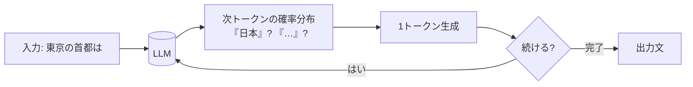

AI システムを正しく設計・選定するには、土台となる **LLM（大規模言語モデル）の原理**を
押さえておくことが近道です。ここでは「なぜそう振る舞うのか」を、図を交えて平易に説明します。

## LLM は「次のトークンを予測する」モデル

LLM は、大量のテキストで学習し、**入力に続いて最も尤もらしい次のトークン（≒単語のかけら）を
確率的に選ぶ**ことを繰り返して文章を生成します。

ポイントは **1トークンずつ・確率的に**生成している、ということです。
ここから LLM の重要な性質が導けます。

## ここから分かる重要な性質

| 性質 | なぜ起きるか | 設計への示唆 |
| --- | --- | --- |
| **出力が毎回ゆらぐ** | 確率的に選ぶため | 完全な再現性は期待しない／評価は複数回で見る |
| **もっともらしい誤り（幻覚）** | 「正しさ」ではなく「尤もらしさ」を選ぶ | 根拠を与える [RAG](/ai-tech-notes/rag/) で抑制 |
| **知識に鮮度の限界** | 学習時点までの知識しか持たない | 最新情報は [RAG](/ai-tech-notes/rag/) / [MCP](/ai-tech-notes/mcp/) で補う |
| **入出力に上限がある** | 一度に扱えるトークン数に制限 | [コンテキストウィンドウ](/ai-tech-notes/llm-basics/context-window/)を意識 |

:::tip[なぜ RAG が必要か]
LLM は「知っていること」を答えるのではなく「もっともらしい続き」を生成します。
だからこそ、社内文書を **根拠として与える** RAG が高精度回答の鍵になります
（→ [RAG の基礎](/ai-tech-notes/rag/)）。
:::

## このセクションの構成

| ページ | 内容 |
| --- | --- |
| [トークン](/ai-tech-notes/llm-basics/tokens/) | テキストの最小単位。コストと密接に関係 |
| [コンテキストウィンドウ](/ai-tech-notes/llm-basics/context-window/) | 一度に扱える入出力の上限 |
| [AIモデルの特徴と選定](/ai-tech-notes/llm-basics/models/) | モデルの階層・機能差・選び方 |
| [生成の制御](/ai-tech-notes/llm-basics/generation-controls/) | max_tokens・ランダム性・推論深さ・ストリーミング |
