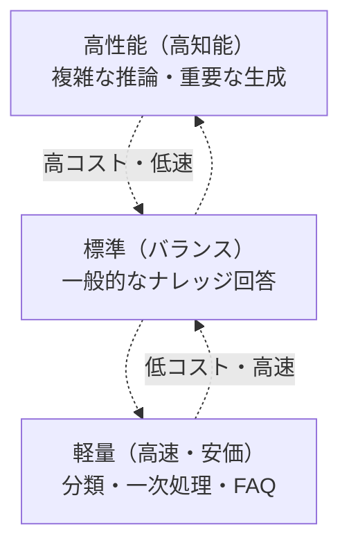
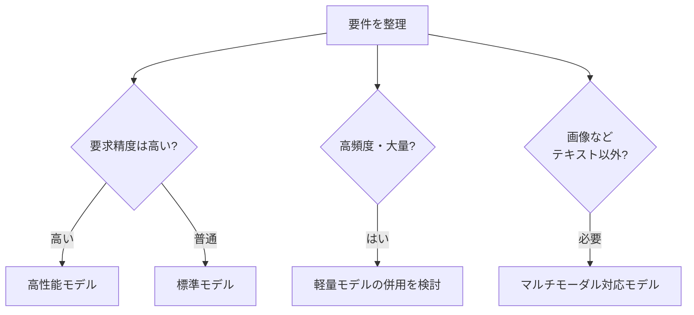

LLM は単一ではなく、**能力・コスト・速度のトレードオフ**で複数のモデルが提供されます。
用途に合ったモデルを選ぶ（そして使い分ける）ことが、品質とコストの両立につながります。

## モデルの「階層」

プロバイダによって名称は異なりますが、概ね次のような階層があります。

| 階層 | 知能 | コスト | 速度 | 主な用途 |
| --- | --- | --- | --- | --- |
| 軽量 | 低〜中 | 低 | 速い | 分類・要約・FAQ・一次処理 |
| 標準 | 中〜高 | 中 | 中 | 一般的な回答（本命になりやすい） |
| 高性能 | 高 | 高 | 遅め | 複雑な推論・重要なレビュー/ドラフト |

## 機能面の違いも確認する

知能やコストだけでなく、**何ができるか**もモデルによって異なります。

| 機能 | 説明 |
| --- | --- |
| マルチモーダル | テキストに加え画像などを入力できるか |
| 推論（thinking） | じっくり考えるモードに対応するか（→ [生成の制御](/ai-tech-notes/llm-basics/generation-controls/)） |
| ツール利用 | 関数呼び出し・[MCP](/ai-tech-notes/mcp/) 連携の安定性 |
| 構造化出力 | JSON 等のスキーマに沿った出力ができるか |
| コンテキスト長 | [コンテキストウィンドウ](/ai-tech-notes/llm-basics/context-window/)の上限 |

## 選定フロー

選定軸の整理:

- **精度要求** — 難所だけ高性能、定型は軽量
- **レイテンシ** — 体感速度が重要なら軽量・事前計算
- **コスト** — 高頻度ほど軽量モデル併用の効果大
- **コンテキスト長 / モダリティ** — 必要な機能を満たすか

より詳しい判断は [システム選定（コスト視点）](/ai-tech-notes/cost-roi/system-selection/)、
使い分けの実装は [モデルの切り替え](/ai-tech-notes/cost-roi/optimization/) を参照してください。

:::caution[モデルは更新が速い]
モデルのラインナップ・性能・価格は頻繁に更新されます。
具体的なモデル名や上限値は、**利用するプロバイダの最新ドキュメントで必ず確認**してください。
本ページは「選び方の枠組み」を示すものです。
:::
