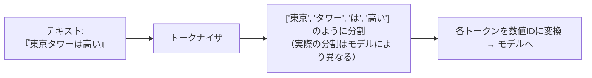
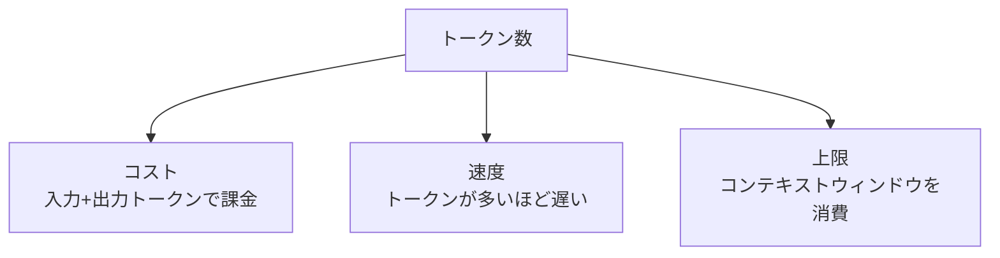

**トークン（token）** は、LLM がテキストを処理するときの最小単位です。
コスト・速度・入出力の上限はすべてトークン数で決まるため、最初に理解しておくべき概念です。

## トークンとは何か

トークンは「単語」より細かいことが多く、単語・部分語・記号・空白などに分割されます。

- ざっくりの目安: 英語は **1単語 ≒ 1〜2トークン**、日本語は文字あたりのトークンが多めになりがち
- **コードや記号、日本語**はトークン効率が悪く、同じ「見た目の長さ」でもトークン数が増えやすい

## なぜ重要か

| 観点 | 関係 |
| --- | --- |
| コスト | 入力トークン + 出力トークン × 単価（出力の方が高いのが一般的） |
| 速度 | 生成トークンが増えるほどレイテンシ増 |
| 上限 | [コンテキストウィンドウ](/ai-tech-notes/llm-basics/context-window/)の消費量 |

## 実務での勘所

- **トークン数は推測せず実測する** — 言語・コードで大きく変わるため、代表的な入力で計測する
- 入力を絞るほどコスト・速度が改善 → [検索とリランキング](/ai-tech-notes/rag/retrieval/) で投入量を最小化
- コスト見積もりは [コスト試算テンプレート](/ai-tech-notes/cost-roi/) を参照

:::note[英語向けトークナイザでの概算に注意]
他社（英語圏）のトークナイザで日本語のトークン数を概算すると、実際より**少なく**見積もりがちです。
使用するモデルのトークンカウント手段で測るのが確実です。
:::
