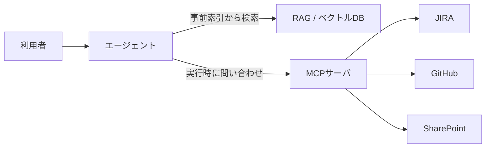

**MCP（Model Context Protocol）** は、LLM / エージェントが外部のツールやデータソースへ
標準化された方法で接続するためのプロトコルです。
ナレッジシステムでは「実行時に外部システムへ問い合わせる」役割を担います。

## RAG との役割分担

- **RAG:** 大量の文書を事前にインデックス化し、意味検索する
- **MCP:** 最新の状態・構造化データ・操作（チケット検索、PR取得など）を都度取得する

## ナレッジシステムでの使いどころ

| 場面 | 向く方式 |
| --- | --- |
| 過去文書からの回答 | RAG |
| 最新のチケット状況を参照 | MCP |
| 文書の更新・作成などの操作 | MCP |
| 大量・静的なナレッジ | RAG |

詳しくは [RAG と MCP の使い分け](/ai-tech-notes/mcp/rag-vs-mcp/) を参照。

## 注意点

MCP は便利な反面、**コンテキストとトークンを消費しやすい**という落とし穴があります
→ [トークン消費問題と対策](/ai-tech-notes/mcp/token-cost/)。

:::note[今後追記]
代表的なMCPサーバ（社内システム連携）の実例を追加予定。
:::
