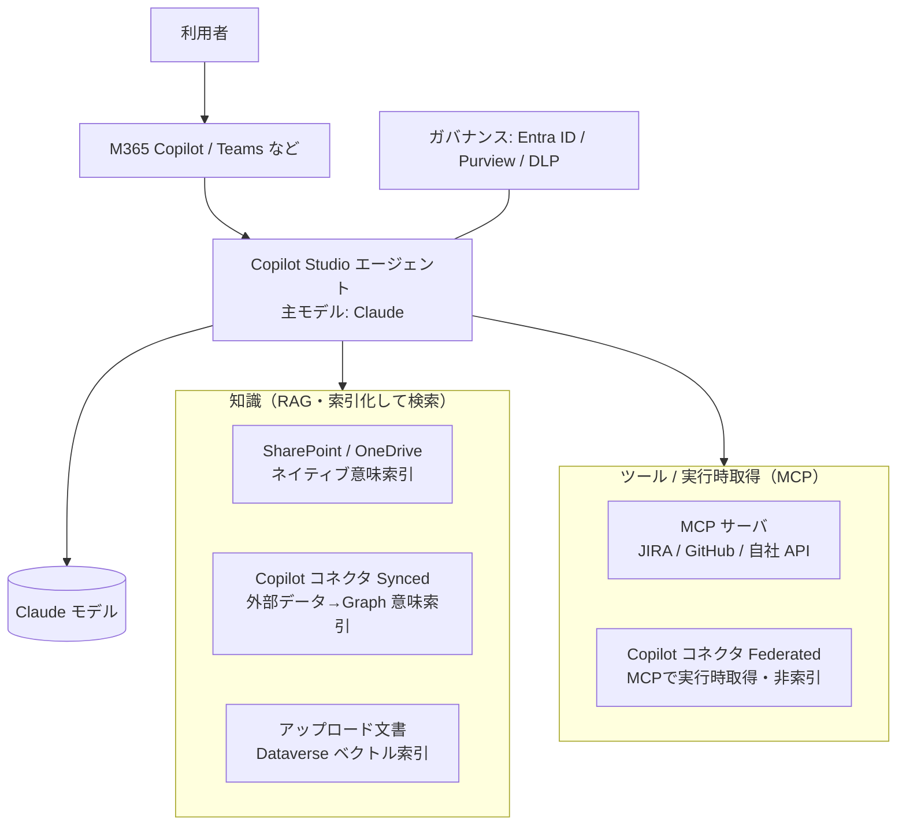

**対象読者:** Microsoft 365 環境で **Claude** をエージェントの頭脳に使い、社内データへ
**RAG（知識）** と **MCP（ツール/実行時取得）** で接続したい人。

ここまでの各章（[RAG](/ai-tech-notes/rag/) / [MCP](/ai-tech-notes/mcp/) /
[データソース](/ai-tech-notes/data-sources/)）を、**Microsoft の製品機能に具体的にマッピング**した
1枚の参考パターンです。

:::caution[製品仕様は更新が速い]
本ページは構成の「型」を示すものです。対応モデル・上限・設定 UI は頻繁に変わるため、
実装前に末尾の **Microsoft Learn** リンクで最新仕様を必ず確認してください。
:::

## 全体構成

## レイヤと製品のマッピング

| レイヤ | Microsoft 側の機能 | 本サイトの該当章 |
| --- | --- | --- |
| フロント | M365 Copilot / Teams にエージェントを公開 | [ユースケース](/ai-tech-notes/use-cases/) |
| エージェント基盤 | Copilot Studio（オーケストレーション） | [システム全体像](/ai-tech-notes/overview/architecture/) |
| モデル | 主モデルに **Anthropic Claude** を選択 | [モデルの特徴と選定](/ai-tech-notes/llm-basics/models/) |
| 知識（RAG） | SharePoint 知識・Copilot コネクタ(Synced)・ファイル索引 | [RAG 設計](/ai-tech-notes/rag/) |
| ツール（MCP） | Copilot Studio の MCP・Copilot コネクタ(Federated) | [MCP 活用](/ai-tech-notes/mcp/) |
| データ源 | SharePoint / File Server / Confluence / JIRA / GitHub | [データソース](/ai-tech-notes/data-sources/) |
| ガバナンス | Entra ID 認証・Purview・DLP | — |

## ① モデル: Claude を主モデルに選ぶ

Copilot Studio では、エージェント作成時に主 AI モデルを選択でき、**Anthropic の Claude**
（Sonnet / Opus 系）を選べます。推論の深さ・品質・レイテンシ・コストに応じて切替可能です。

- 設定箇所: エージェントの **Model** セクションで Anthropic を選択
- 注意: **リージョン/テナント設定**で利用可否が異なる（EU/EFTA・UK・GCC など）。
  Anthropic は Microsoft の**サブプロセッサ**として提供され、CCC（著作権補償）対象。
- 参考: [主モデルの選択](https://learn.microsoft.com/en-us/microsoft-copilot-studio/authoring-select-agent-model) /
  [Copilot（M365 アプリ）での Anthropic モデル](https://learn.microsoft.com/en-us/microsoft-365/copilot/copilot-anthropic-apps) /
  [Anthropic models in Microsoft Online Services](https://learn.microsoft.com/en-us/microsoft-365/copilot/connect-to-ai-subprocessor)

## ② 知識（RAG）の接続

「静的・大量で、検索して根拠にしたい」データは**索引化（RAG）**します。Microsoft 側には2つの索引経路があります。

### a. ネイティブ意味索引（SharePoint / OneDrive）

SharePoint / OneDrive のコンテンツは Microsoft 365 の**意味索引**に既に乗っており、
Copilot Studio から **知識ソース**として直接グラウンディングできます。

- 設定: エージェントの **Knowledge** に SharePoint を追加（サイト/フォルダ単位）
- 構造化データは **SharePoint リスト**も知識ソースにできる
- 参考: [SharePoint を知識ソースに追加](https://learn.microsoft.com/en-us/microsoft-copilot-studio/knowledge-add-sharepoint) /
  [知識ソースの概要](https://learn.microsoft.com/en-us/microsoft-copilot-studio/knowledge-copilot-studio) /
  [Copilot Studio の RAG ガイダンス](https://learn.microsoft.com/en-us/microsoft-copilot-studio/guidance/retrieval-augmented-generation)

### b. 外部データを索引化（Copilot コネクタ — Synced）

Confluence・File Server・社内 DB などの**外部データ**は、**Copilot コネクタ（Synced）**で
Microsoft Graph の意味索引へ取り込み、Copilot から検索できるようにします（＝プラットフォーム側の RAG）。

- プレビルトコネクタが 100 種類以上。無ければ Agents Toolkit / Graph connectors API で自作
- スキーマ定義・Entra ID へのアプリ登録・取り込みコードが必要
- 参考: [Copilot コネクタ概要（Synced/Federated）](https://learn.microsoft.com/en-us/microsoft-365/copilot/connectors/overview) /
  [プレビルトコネクタ](https://learn.microsoft.com/en-us/microsoft-365/copilot/connectors/prebuilt-connectors-overview) /
  [拡張機能の概要](https://learn.microsoft.com/en-us/microsoft-365/copilot/extensibility/overview-copilot-connector)

### c. ファイルアップロード（Dataverse ベクトル索引）

エージェントに直接アップロードした文書は、Dataverse が**意味索引・ベクトル埋め込み**に変換して
グラウンディングに使います。少量の補助ナレッジ向け。

## ③ ツール（MCP）の接続

「最新状態の参照」や「操作」が要るものは、索引化せず **MCP** で実行時に取得します。

### a. Copilot Studio に MCP サーバを追加

- 手順: エージェントの **Tools → Add a tool → Model Context Protocol**
- 既存 MCP サーバをリストから選ぶ／ウィザードで新規接続（Server name・URL を入力）
- **認証:** API key または **OAuth 2.0**
- 取得できるもの: **Tools（操作）/ Resources（読み取りデータ）/ Prompts（テンプレ）**。
  不要なツールは個別トグルで OFF（[トークン浪費対策](/ai-tech-notes/anti-patterns/mcp-token-waste/)）
- 参考: [MCP でエージェントを拡張](https://learn.microsoft.com/en-us/microsoft-copilot-studio/agent-extend-action-mcp) /
  [既存 MCP サーバへ接続](https://learn.microsoft.com/en-us/microsoft-copilot-studio/mcp-add-existing-server-to-agent) /
  [MCP のツール/リソースを追加](https://learn.microsoft.com/en-us/microsoft-copilot-studio/mcp-add-components-to-agent)

### b. Copilot コネクタ（Federated）という選択肢

プラットフォーム側でも、**Federated コネクタ**は MCP を用いて**実行時にデータを取得**し、
**Graph に索引化しません**（同期・保存なし）。最新性重視のソースに向きます。

## RAG と MCP の使い分け（この構成での対応）

Microsoft の2つのコネクタモデルは、本サイトの使い分けにそのまま対応します。

| 区分 | Microsoft 側 | 向くデータ | 本サイト |
| --- | --- | --- | --- |
| RAG（索引して検索） | Synced コネクタ / SharePoint 知識 | 静的・大量・出典が要る | [RAG](/ai-tech-notes/rag/) |
| MCP（実行時取得・操作） | MCP サーバ / Federated コネクタ | 動的・最新・操作 | [RAG と MCP の使い分け](/ai-tech-notes/mcp/rag-vs-mcp/) |

## 設定・運用のチェックリスト

- [ ] **権限の継承**: SharePoint/Graph のアクセス権がそのまま回答の絞り込みに効いているか（[権限フィルタ](/ai-tech-notes/rag/retrieval/)）
- [ ] **RAG/MCP の切り分け**: 静的は Synced、動的は MCP/Federated に振り分けたか
- [ ] **重複・失効**: 同じ文書を複数経路で二重に索引していないか／削除が伝播するか（[重複対策](/ai-tech-notes/anti-patterns/data-duplication/)）
- [ ] **MCP のツール最小化**: 使うツールだけ ON にしてトークンを抑えたか（[トークン対策](/ai-tech-notes/mcp/token-cost/)）
- [ ] **モデル選定**: ユースケースに対し Claude のモデル/設定が妥当か（[コスト・ROI](/ai-tech-notes/cost-roi/system-selection/)）
- [ ] **ガバナンス**: Entra ID 認証・Purview/DLP・リージョン要件を満たしているか

## 参考リンク（Microsoft Learn 優先）

- モデル: [主モデルの選択](https://learn.microsoft.com/en-us/microsoft-copilot-studio/authoring-select-agent-model) /
  [外部モデルを主モデルに](https://learn.microsoft.com/en-us/microsoft-copilot-studio/authoring-select-external-response-model) /
  [Anthropic モデル（M365 アプリ）](https://learn.microsoft.com/en-us/microsoft-365/copilot/copilot-anthropic-apps) /
  [サブプロセッサ](https://learn.microsoft.com/en-us/microsoft-365/copilot/connect-to-ai-subprocessor)
- RAG / 知識: [RAG ガイダンス](https://learn.microsoft.com/en-us/microsoft-copilot-studio/guidance/retrieval-augmented-generation) /
  [知識ソース概要](https://learn.microsoft.com/en-us/microsoft-copilot-studio/knowledge-copilot-studio) /
  [SharePoint 知識](https://learn.microsoft.com/en-us/microsoft-copilot-studio/knowledge-add-sharepoint) /
  [Retrieval API](https://learn.microsoft.com/en-us/microsoft-365/copilot/extensibility/api/ai-services/retrieval/overview)
- コネクタ（RAG/MCP）: [コネクタ概要](https://learn.microsoft.com/en-us/microsoft-365/copilot/connectors/overview) /
  [プレビルトコネクタ](https://learn.microsoft.com/en-us/microsoft-365/copilot/connectors/prebuilt-connectors-overview) /
  [拡張機能の概要](https://learn.microsoft.com/en-us/microsoft-365/copilot/extensibility/overview-copilot-connector)
- MCP: [MCP で拡張](https://learn.microsoft.com/en-us/microsoft-copilot-studio/agent-extend-action-mcp) /
  [既存 MCP サーバへ接続](https://learn.microsoft.com/en-us/microsoft-copilot-studio/mcp-add-existing-server-to-agent) /
  [ツール/リソース追加](https://learn.microsoft.com/en-us/microsoft-copilot-studio/mcp-add-components-to-agent)

:::note
URL・機能名は 2026 年 6 月時点の調査に基づきます。Microsoft の製品更新で変わる場合があるため、リンク先で最新情報を確認してください。
:::
