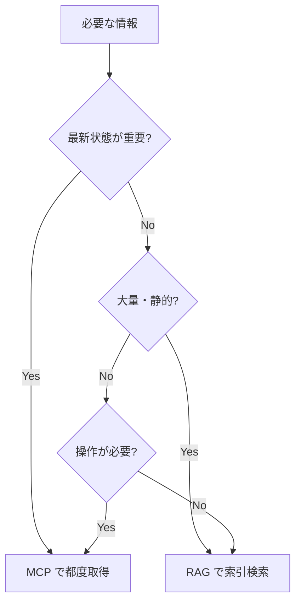

RAG と MCP は競合ではなく **補完関係** です。データの性質で使い分けます。

## 判断フロー

## 比較表

| 観点 | RAG | MCP |
| --- | --- | --- |
| データの性質 | 静的・大量 | 動的・最新・構造化 |
| 取得タイミング | 事前にインデックス | 実行時 |
| 得意なこと | 意味検索・出典提示 | 状態参照・操作 |
| コスト注意点 | インデックス維持 | トークン消費 |
| 代表ソース | 文書・Wiki | JIRA・GitHub・SharePoint |

## 併用パターン

多くの実システムは **RAG をベースに、MCP を必要箇所で併用** します。
例: 過去仕様は RAG で回答しつつ、関連 JIRA の最新状況だけ MCP で補う。

:::note[今後追記]
併用時のオーケストレーション（どちらを先に呼ぶか）の設計を追加予定。
:::
