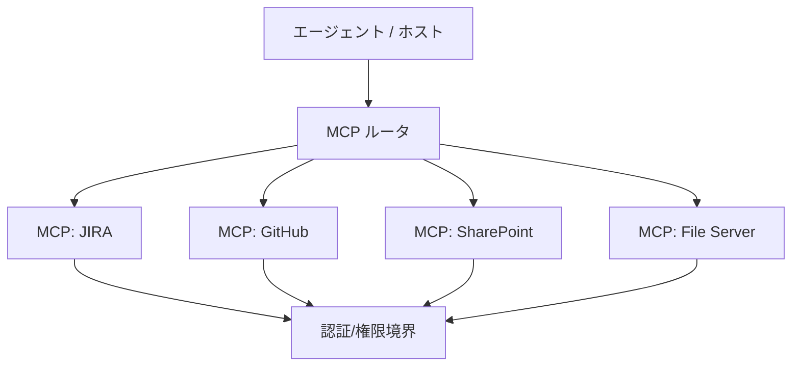

ナレッジシステムで MCP サーバをどう構成し、どこに置くかを整理します。

## 典型構成

## 設計の勘所

- **最小権限:** サーバごとにスコープを絞り、書き込み系は明示的に分離
- **ツール数を絞る:** ツール定義もトークンを食う → [トークン対策](/ai-tech-notes/mcp/token-cost/)
- **結果の整形:** 巨大なレスポンスはサーバ側で要約/フィルタしてから返す
- **監査ログ:** 誰が何を取得・操作したかを記録

## 提供する操作の例

| ソース | 読み取り | 操作（要注意） |
| --- | --- | --- |
| JIRA | チケット検索・取得 | コメント追加・起票 |
| GitHub | PR/Issue/コード取得 | コメント・ラベル付与 |
| SharePoint | 文書検索・取得 | 文書作成・更新 |

:::note[今後追記]
セルフホスト vs マネージドの選定、認証方式の比較を追加予定。
:::
