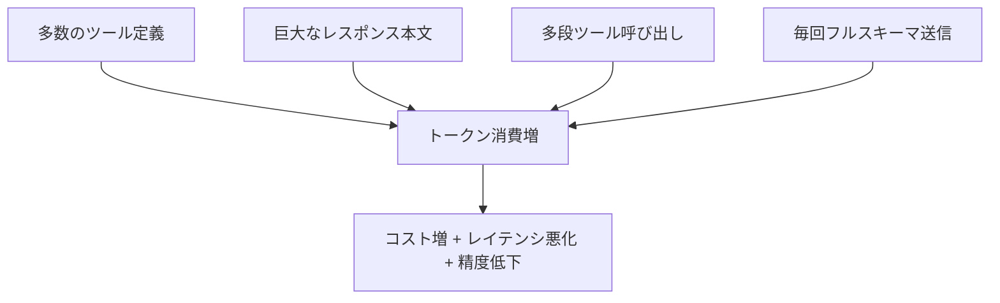

MCP は強力ですが、**ツール定義・大きなレスポンス・多段の呼び出し** によって
コンテキストとトークンを急速に消費し、コストとレイテンシを悪化させます。
ここは設計段階で必ず対策しておくべき重要ポイントです。

## トークンが膨らむ主因

## 対策

| 対策 | 効果 |
| --- | --- |
| ツールを必要最小限に絞る | 定義トークンの削減 |
| サーバ側で要約・フィールド選択 | レスポンスの肥大化を防ぐ |
| ページング/上限件数 | 一度に返す量を制御 |
| 結果のキャッシュ | 同一問い合わせの重複を回避 |
| RAGで代替できる部分はRAGへ | 静的知識はMCPで都度取得しない |

## 判断の指針

- **静的・大量** のナレッジ → [RAG](/ai-tech-notes/rag/) に寄せる
- **動的・少量・最新性重視** → MCP で都度取得
- コスト試算は [コスト・ROI](/ai-tech-notes/cost-roi/) を参照

:::tip
「とりあえず全部 MCP」は典型的なアンチパターンです → [MCPトークン浪費](/ai-tech-notes/anti-patterns/mcp-token-waste/)。
:::
