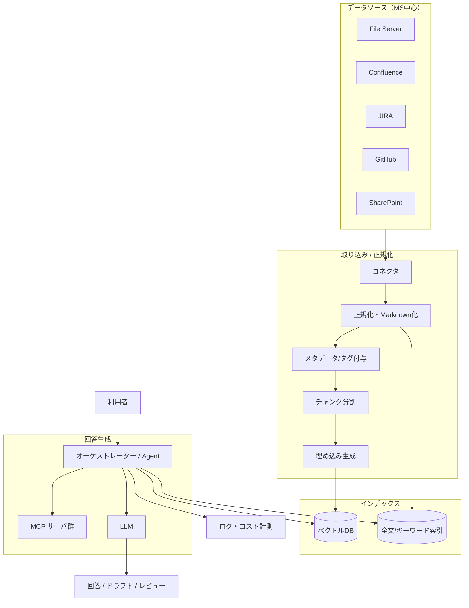
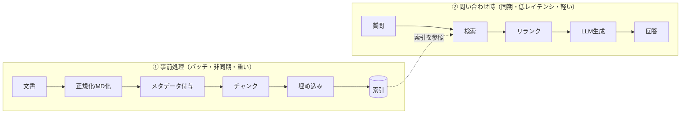

ナレッジ AI システムの全体像を俯瞰します。
このページは「**何で構成するか**」だけでなく、**「なぜこの構成なのか」**——
設計判断の背景と、意図的に**避けたアンチパターン**——までを説明する、本サイトの起点となるページです。
個々の要素は各セクションで深掘りします。

## 全体アーキテクチャ

## 構成要素のマッピング

| レイヤ | 役割 | 関連セクション |
| --- | --- | --- |
| データソース | 一次情報の所在 | [データソース](/ai-tech-notes/data-sources/) |
| 取り込み・正規化 | 収集・MD化・メタデータ付与 | [データ設計・形式](/ai-tech-notes/data-modeling/) |
| インデックス | ベクトル/キーワード検索 | [RAG 設計](/ai-tech-notes/rag/) |
| 回答生成 | 検索→生成、ツール連携 | [RAG](/ai-tech-notes/rag/) / [MCP](/ai-tech-notes/mcp/) |
| 運用・コスト | 可観測性・最適化 | [コスト・ROI](/ai-tech-notes/cost-roi/) |

## 2つのデータの流れ（事前処理と問い合わせ）

上の図は1枚にまとめていますが、実際には性質の異なる **2つのパス** が走っています。
ここを分けて捉えることが、設計理解の第一歩です。

| パス | タイミング | 性質 | 最適化の方向 |
| --- | --- | --- | --- |
| ① 事前処理 | データ更新時にバッチ | 重い・まとめて実行 | 増分同期でコスト削減 |
| ② 問い合わせ | ユーザー操作のたび | 軽く・速く | コンテキストを絞り低コスト/低遅延 |

**なぜ分けるのか:** 埋め込み生成や抽出は重い処理で、毎回やると遅く高コストです。
事前にインデックス化しておけば、問い合わせ時は「検索して渡す」だけで済み、速く安く回答できます。

## なぜこの設計に至ったか（設計判断の背景）

各レイヤの構成は、いくつかの明確な判断の積み重ねです。
それぞれ **判断 → 背景・理由 → 避けたアンチパターン** の形で整理します。

### 1. 基盤は RAG（ファインチューニングや全文投入ではない）

- **判断:** 社内知識の利用は **RAG を第一選択**とする。
- **背景・理由:** 目的は「最新の社内知識に基づく**正確で出典付き**の回答」。
  ファインチューニングは知識の鮮度に弱く更新コストが高い。長文をそのまま投入する方式は大量データで破綻する。
- **避けたアンチパターン:** モデルに知識を「覚えさせる」発想（更新不能・幻覚は消えない）。
  → 詳細: [RAG/FT/長文投入の使い分け](/ai-tech-notes/rag/)

### 2. 一次情報は「参照」し、複製しない

- **判断:** AI 用にデータを別の場所へ**コピーしない**。元を参照し、索引には最新版のみを置く。
- **背景・理由:** 複製は必ず**版ずれ**を生み、古い情報での回答や矛盾を招く。
- **避けたアンチパターン:** 「AI 用データレイク」に全コピー → 重複・失効・どれが正本か不明。
  → 詳細: [データ複製と重複バージョン問題](/ai-tech-notes/anti-patterns/data-duplication/) / [バージョン管理](/ai-tech-notes/data-modeling/versioning/)

### 3. 検索はハイブリッド ＋ リランクの二段

- **判断:** ベクトル検索とキーワード検索を併用し、リランクで絞ってから LLM に渡す。
- **背景・理由:** ベクトルは言い換えに強いが**固有名詞・型番・略語**に弱い。社内文書はこれらが多い。
  広く取って（再現率）→ 精度よく絞る（適合率）の二段が安定。
- **避けたアンチパターン:** 単一のベクトル検索のみ → 取りこぼし。top_k を闇雲に増やす → ノイズ・コスト増。
  → 詳細: [検索とリランキング](/ai-tech-notes/rag/retrieval/)

### 4. RAG と MCP を役割分担で併用

- **判断:** 静的・大量の知識は **RAG**、最新状態・操作が要るものは **MCP** で実行時取得。
- **背景・理由:** 競合ではなく補完関係。両者を適材適所にすると精度とコストのバランスが取れる。
- **避けたアンチパターン:** 何でも MCP でリアルタイム取得 → トークン浪費・レイテンシ悪化。
  → 詳細: [RAG と MCP の使い分け](/ai-tech-notes/mcp/rag-vs-mcp/) / [MCPトークン浪費](/ai-tech-notes/anti-patterns/mcp-token-waste/)

### 5. オーケストレーター（Agent）を中心に置く

- **判断:** 利用者と各コンポーネントの間に**オーケストレーター**を挟み、検索・MCP・LLM 呼び出しを束ねる。
- **背景・理由:** ユースケース（[回答/ドラフト/レビュー](/ai-tech-notes/use-cases/)）ごとに流れが違う。
  分岐・フォールバック・権限チェック・ログ取得を一箇所に集約すると運用しやすい。
- **避けたアンチパターン:** フロントから LLM を直叩き → 権限・コスト・ログが分散し統制不能。

### 6. 取り込みで「正規化（MD）＋メタデータ」を必須化

- **判断:** 取り込み時に **Markdown 正規化**し、**メタデータ（出典・更新日・権限・タグ）**を必ず付ける。
- **背景・理由:** 形式が揃うとチャンク・検索精度が上がる。メタデータが無いと絞り込みも出典提示もできない。
- **避けたアンチパターン:** バイナリ Office を無加工で投入、メタデータ無しで丸投げ。
  → 詳細: [データ設計・形式](/ai-tech-notes/data-modeling/) / [メタデータ](/ai-tech-notes/data-modeling/metadata/)

### 7. 権限は「検索段」で効かせる（後付けにしない）

- **判断:** 元システムのアクセス権を索引に反映し、**検索の段階で**ユーザー権限により絞り込む。
- **背景・理由:** 生成後にフィルタする方式は漏れやすい。権限は最初から設計に織り込む必要がある。
- **避けたアンチパターン:** 権限を後付け／無視した全文索引 → 情報漏えいリスク。
  → 詳細: [権限フィルタ](/ai-tech-notes/rag/retrieval/)

### 8. 可観測性・コスト計測を最初から組み込む

- **判断:** プロンプト・トークン消費・レイテンシ・コストを**最初からログ計測**する。
- **背景・理由:** トークン課金は「気づいたら高い」。後から計測基盤を足すのは難しい。
- **避けたアンチパターン:** コスト未計測のまま全社展開 → 想定外の請求・改善の手がかり無し。
  → 詳細: [コスト・ROI](/ai-tech-notes/cost-roi/)

## 避けたアンチパターン（設計レベルまとめ）

上記を一覧にすると、この設計は次の落とし穴を構造的に回避しています。

| アンチパターン | 何が起きるか | 本設計での回避策 |
| --- | --- | --- |
| AI 用にデータを全コピー | 重複・版ずれ・失効 | 参照を基本（複製しない） |
| 何でも MCP でリアルタイム取得 | トークン浪費・遅延 | 静的は RAG、動的のみ MCP |
| 巨大コンテキストに全文投入 | コスト増・精度低下 | 検索で絞ってから渡す |
| 単一のベクトル検索のみ | 固有名詞の取りこぼし | ハイブリッド ＋ リランク |
| 評価なしで本番投入 | 改善が当て推量になる | オフライン評価を組み込む |
| 権限を後付け | 情報漏えいリスク | 検索段で権限フィルタ |
| コスト未計測で全社展開 | 想定外の高コスト | 設計段階で試算 ＋ 継続監視 |
| フロントから LLM 直叩き | 統制・ログが分散 | オーケストレーターに集約 |

## 規模別の構成バリエーション

同じ全体像でも、フェーズによって作り込む深さが変わります。**小さく始めて計測しながら広げる**のが原則です。

| 観点 | PoC（検証） | 部門展開 | 全社展開 |
| --- | --- | --- | --- |
| データソース | 1〜2種 | 主要な数種 | 全社横断 |
| 検索 | ベクトルのみでも可 | ハイブリッド | ハイブリッド ＋ リランク |
| 権限 | 限定/簡易 | 部門単位 | 元システム権限を厳密反映 |
| 評価 | 小さな評価セット | 定例評価 | CI 的に自動評価 |
| MCP 連携 | 任意 | 主要連携 | 統制された複数連携 |
| 運用 | 手動 | ログ・コスト監視 | 可観測性・アラート・増分同期 |

## コンポーネント選定の指針

- **モデル:** 工程ごとに使い分け（軽量＝分類/要約、高性能＝最終生成）。
  → [AIモデルの特徴と選定](/ai-tech-notes/llm-basics/models/) / [システム選定](/ai-tech-notes/cost-roi/system-selection/)
- **ベクトル DB:** まずは既存基盤（RDB のベクトル拡張など）で要件を満たせないか検討。
  → [システム選定（ベクトルDB観点）](/ai-tech-notes/cost-roi/system-selection/)
- **取り込み:** 増分同期と失効処理をセットで設計（[索引から外す処理](/ai-tech-notes/data-sources/)）。

## 設計レビュー・チェックリスト

新しいナレッジ AI システムの構成を点検するときの観点です。

- [ ] 知識の利用は RAG が基本になっているか（FT に頼っていないか）
- [ ] 一次情報を複製せず参照しているか（失効同期はあるか）
- [ ] 検索はハイブリッド＋リランクか／権限フィルタは検索段にあるか
- [ ] RAG と MCP の役割分担は明確か（何でも MCP になっていないか）
- [ ] 取り込みで正規化（MD）＋メタデータ付与をしているか
- [ ] 評価データセットがあり、変更のたびに計測しているか
- [ ] トークン/コスト/レイテンシを最初から計測しているか
- [ ] 規模（PoC→部門→全社）に応じた段階計画があるか

:::tip
このページは「なぜ」をまとめた地図です。各判断の実装詳細は、リンク先の各セクションで深掘りしてください。
:::
