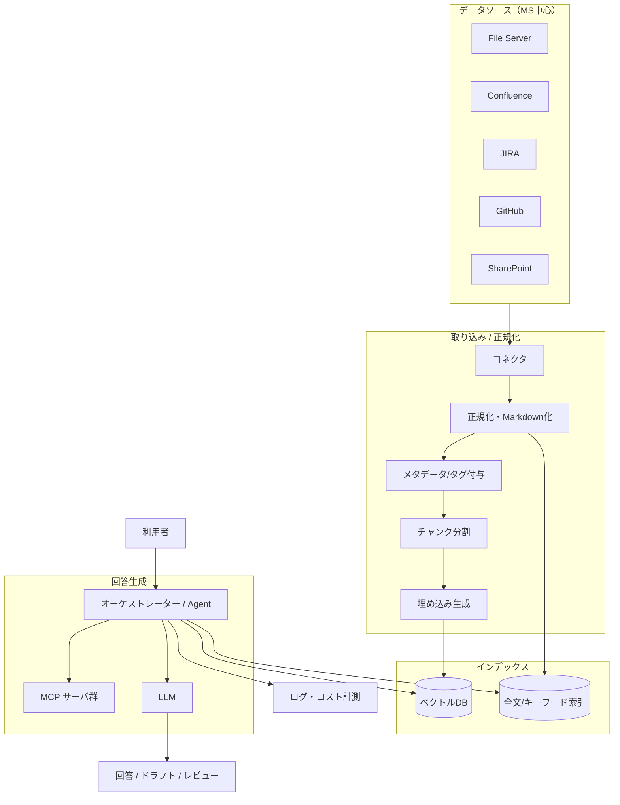

ナレッジ AI システムの全体像を俯瞰します。個々の要素は各セクションで深掘りします。

## 全体アーキテクチャ

## 構成要素のマッピング

| レイヤ | 役割 | 関連セクション |
| --- | --- | --- |
| データソース | 一次情報の所在 | [データソース](/ai-tech-notes/data-sources/) |
| 取り込み・正規化 | 収集・MD化・メタデータ付与 | [データ設計・形式](/ai-tech-notes/data-modeling/) |
| インデックス | ベクトル/キーワード検索 | [RAG 設計](/ai-tech-notes/rag/) |
| 回答生成 | 検索→生成、ツール連携 | [RAG](/ai-tech-notes/rag/) / [MCP](/ai-tech-notes/mcp/) |
| 運用・コスト | 可観測性・最適化 | [コスト・ROI](/ai-tech-notes/cost-roi/) |

## 設計の基本原則

- **一次情報は複製せず参照する** — 複製は重複バージョン問題の温床（[アンチパターン](/ai-tech-notes/anti-patterns/data-duplication/)）
- **検索は二段構え** — ベクトル検索 + キーワード検索のハイブリッド
- **コストは設計段階で見積もる** — トークン消費は後から効いてくる（[コスト・ROI](/ai-tech-notes/cost-roi/)）

:::note[今後追記]
各コンポーネントの選定基準と、規模別（PoC / 部門 / 全社）の構成バリエーションを追加予定。
:::
