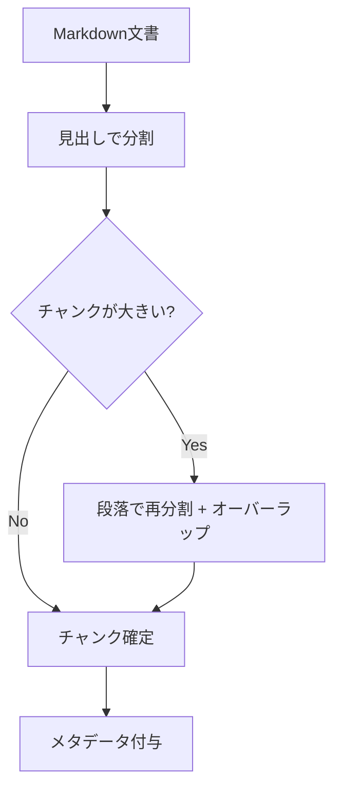

チャンク（分割単位）の設計は、RAG 精度に最も影響する要素のひとつです。
大きすぎるとノイズが増え、小さすぎると文脈が失われます。

## 主なチャンク方式

| 方式 | 特徴 | 向くケース |
| --- | --- | --- |
| 固定長 | 実装が簡単、文脈が切れやすい | 均質なテキスト |
| 意味単位 | 見出し・段落で分割 | 構造化された文書（MD推奨） |
| 階層 | 親(章)-子(段落)を保持 | 長文・仕様書 |
| スライディングウィンドウ | 重複を持たせ文脈を維持 | 連続性が重要な文書 |

## 推奨の出発点

- Markdown の **見出し構造を尊重** して分割する（[Markdown推奨](/ai-tech-notes/data-modeling/)）
- チャンクに **オーバーラップ**（例: 10〜15%）を持たせる
- 各チャンクに出典メタデータ（doc_id, 見出しパス）を付与する

:::note[今後追記]
チャンクサイズの実測比較と、表・コードブロックの扱いを追加予定。
:::
