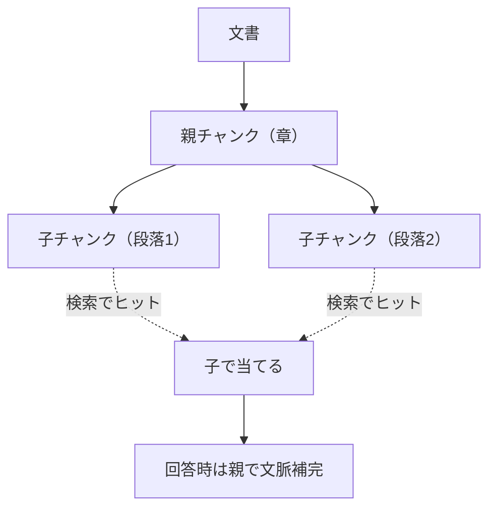
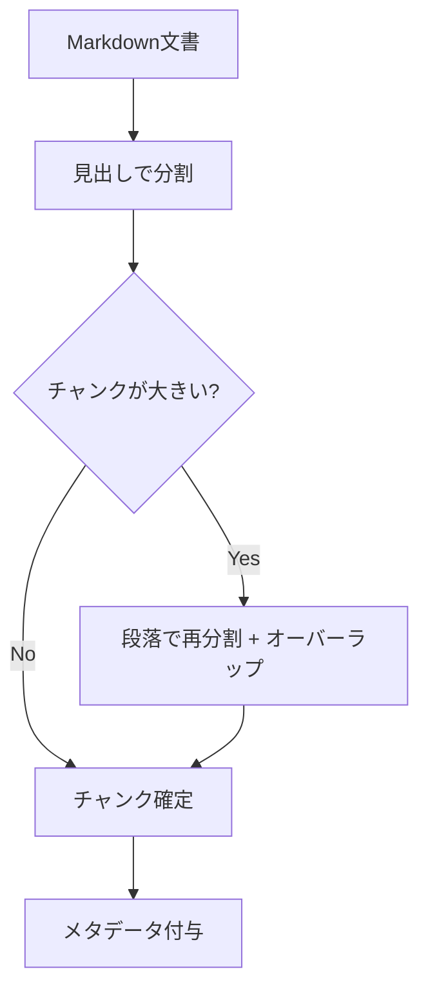

チャンク（分割単位）の設計は、RAG 精度に最も影響する要素のひとつです。
大きすぎるとノイズが増え、小さすぎると文脈が失われます。
「検索で当たるか」と「当たった塊が回答に十分な文脈を持つか」の両立がゴールです。

## なぜチャンクが効くのか

検索は基本的に **チャンク単位**でヒットします。つまりチャンクの切り方が、

- **検索のヒット率**（小さすぎると文脈不足で当たらない／大きすぎると無関係語が混ざる）
- **回答の質**（当たったチャンクに答えが収まっているか）
- **コスト**（大きいチャンクを多数渡すと投入トークンが膨らむ）

のすべてを左右します。

## 主なチャンク方式

| 方式 | 特徴 | 向くケース |
| --- | --- | --- |
| 固定長 | 実装が簡単、文脈が切れやすい | 均質なテキスト |
| 意味単位 | 見出し・段落で分割 | 構造化された文書（MD推奨） |
| 階層（親子） | 親(章)-子(段落)を保持 | 長文・仕様書 |
| スライディングウィンドウ | 重複を持たせ文脈を維持 | 連続性が重要な文書 |

### 固定長分割

トークン数で機械的に区切る方式。実装は簡単ですが、文の途中や論理の切れ目を無視して切るため、
文脈が分断されやすいのが弱点です。オーバーラップ（後述）と組み合わせて緩和します。

### 意味単位分割（推奨の出発点）

見出し・段落など**文書構造**に沿って分割します。Markdown の見出し構造を活かせるため、
[Markdown 推奨](/ai-tech-notes/data-modeling/) のデータと相性が良く、出典提示も精密になります。

### 階層（親子）チャンク

検索は小さな子チャンクで精度よく当て、回答時には親（章・節）を渡して文脈を補う方式です。
「ヒット精度」と「文脈の十分さ」を両立しやすく、長い仕様書で有効です。

## チャンクサイズとオーバーラップ

| パラメータ | 小さくすると | 大きくすると |
| --- | --- | --- |
| チャンクサイズ | ヒット精度↑・文脈不足になりやすい | 文脈豊富・ノイズ↑・コスト↑ |
| オーバーラップ | 境界での文脈欠落リスク↑ | 文脈維持↑・重複でコスト/冗長↑ |

実務的な出発点:

- まずは **意味単位（見出し）** で分割し、大きすぎる塊だけ段落で再分割
- **オーバーラップは 10〜15% 程度**から始める
- 1つの正解が1チャンクに収まる粒度を狙う（またがると検索精度が落ちる）

## 構造を活かす・特殊要素の扱い

- **見出しパスを保持**: 「章 > 節 > 小節」をメタデータに持たせると、出典提示と絞り込みが効く
- **表**: 行で機械分割すると壊れる。表は1つの塊として保持するか、Markdown 表のまま渡す
- **コードブロック**: 途中で切らない。関数・ブロック単位を意識
- **画像/図**: キャプションや代替テキストをテキスト化して索引に含める

## メタデータの付与

各チャンクには文書メタデータを継承し、出典情報を必ず添えます。

- `doc_id` / `source`（原文への導線）
- 見出しパス（章・節）
- `updated_at` / `team` / `doc_type`（検索フィルタ用）

詳細は [メタデータ付与](/ai-tech-notes/data-modeling/metadata/) を参照。

## アンチパターン

- **巨大チャンク**で「とりあえず全部入れる」→ ノイズ増・コスト増・精度低下
- **改行や固定長で機械的に分割**して表・コードを破壊
- メタデータ無しで投入 → 絞り込めず出典も出せない
- 1つの正解が複数チャンクにまたがる粒度 → どちらも中途半端でヒットしない

## テックリードが訊いてくる質問

> **Q. 「チャンクサイズは結局いくつが正解？」**
> A. 唯一解はありません。意味単位を基準に、評価データで複数サイズを比較して決めます（[評価](/ai-tech-notes/rag/evaluation/)）。

> **Q. 「文書を更新したらチャンクはどうなる？」**
> A. 変更分だけ再チャンク・再埋め込みする増分更新にします。旧チャンクが残ると古い情報が混ざります（[重複対策](/ai-tech-notes/anti-patterns/data-duplication/)）。

> **Q. 「表や仕様書がうまく拾えない」**
> A. 機械的な固定長分割が原因のことが多いです。表・コードを壊さない意味単位分割や親子チャンクを検討します。

> **Q. 「チャンクを変えたら精度が変わった。再現できる？」**
> A. チャンク設定はバージョン管理し、評価スコアと紐づけて記録します。変更＝再評価をルール化します。
