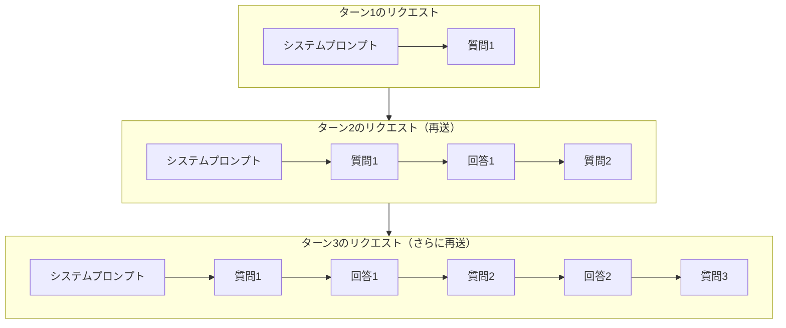
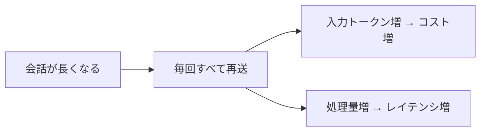
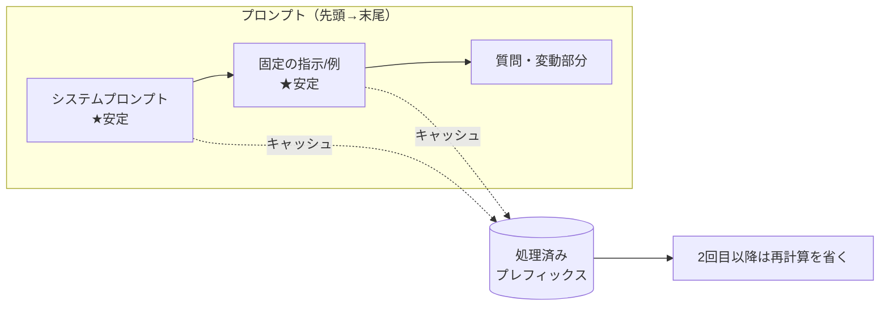
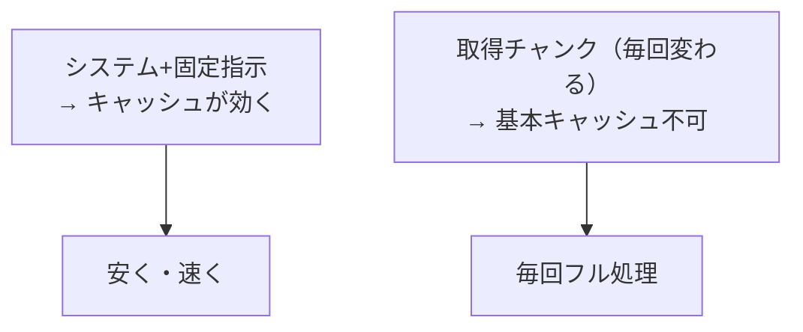

RAG のコストと挙動を正しく理解するうえで、最重要かつ誤解されやすいのが
**「LLM は記憶を持たない（ステートレス）」**という事実です。
ここを押さえると、なぜ毎回コンテキストに全部載せるのか、そしてキャッシュで何が変わるのかが腑に落ちます。

## 事実: LLM はステートレス（記憶を持たない）

LLM への API 呼び出しは **1回ごとに独立**しています。モデルは前回のやり取りを**一切覚えていません**。
したがって、回答に必要な情報は **毎回すべてコンテキストウィンドウに載せて送る**必要があります。

毎リクエストで送るもの:

- **システムプロンプト**（役割・制約）
- **会話履歴**（過去のやり取り全部）
- **RAG で取得した文書**（根拠）
- **今回のユーザーの質問**

:::note[「記憶しているように見える」のは錯覚]
チャット AI が会話を覚えているように見えるのは、**クライアント（アプリ側）が過去の履歴を
毎回まとめて再送している**からです。モデル自体が状態を保持しているわけではありません。
:::

### これが RAG のコストに効く

ステートレスゆえに、マルチターン会話では **履歴と取得文書が毎ターン再送 → 毎ターン再課金・再計算**されます。
会話が長くなるほど、1ターンあたりのコストとレイテンシが膨らみます。

対策の方向性:

- 履歴を**要約・圧縮**して再送量を抑える
- RAG で投入する文書は**必要な分だけ**に絞る（[検索とリランキング](/ai-tech-notes/rag/retrieval/)）
- そして次の **プロンプトキャッシュ**で、再送する固定部分の再計算を省く

## プロンプトキャッシュで何が変わるか

ここが重要な誤解ポイントです。

:::caution[キャッシュは「記憶」ではない]
プロンプトキャッシュを使っても、**LLM がステートレスである事実は変わりません**。
依然として毎回すべてを送ります。変わるのは、**同じ前置き部分の「再計算」をプロバイダ側が省く**点だけです。
結果として **安く・速く**なりますが、モデルが内容を覚えているわけではありません。
:::

### 仕組み: プレフィックス（先頭一致）キャッシュ

多くのプロバイダのキャッシュは **プレフィックス一致**で動きます。
プロンプトの**先頭から変わっていない部分**を処理済みとしてキャッシュし、2回目以降は再計算を省きます。

鉄則は **「安定した内容を先頭に、変動する内容を末尾に」**。
先頭に時刻・UUID・ユーザー名など毎回変わる値を入れると、**そこから後ろのキャッシュが全部無効**になります。

### 経済性（一般的な傾向）

| 区分 | コスト感 | 補足 |
| --- | --- | --- |
| キャッシュ**読み取り** | 通常入力の **約 1/10** | 同じ前置きを再利用するほど得 |
| キャッシュ**書き込み** | 通常入力の **約 1.25 倍**（短期）／**約 2 倍**（長期TTL） | 数回読まれれば元が取れる |
| 有効期限（TTL） | **既定は数分（約5分）**、延長すると**1時間**程度 | アクセス間隔に合わせる |

### RAG 特有の注意（ここが盲点）

RAG で取得するチャンクは **クエリごとに変わる**ため、そのままでは「安定したプレフィックス」になりません。
つまり **取得文書はキャッシュが効きにくい**のが普通です。

キャッシュが効くのは主に:

- **システムプロンプト**や**固定の指示・few-shot 例**（毎回同じ先頭部分）
- **同じ会話の継続**（前ターンまでの履歴は変わらないのでプレフィックスとして再利用）
- 全クエリ共通の**大きな前置き文書**（あれば）

## AIモデルごとの挙動（具体例）

キャッシュやコンテキストの挙動は **モデルによって異なります**。代表的な差は次の通りです。

### 1. キャッシュが効く「最小トークン数」が違う

プレフィックスが一定の長さに満たないと、**キャッシュは静かに効きません**（エラーは出ない）。
この最小長はモデルで異なります。

| モデル（例） | キャッシュ可能な最小プレフィックス（目安） |
| --- | --- |
| Claude Opus 4.x / Haiku 4.5 | 約 4,096 トークン |
| Claude Sonnet 4.6 | 約 2,048 トークン |
| 一部の旧 Sonnet 系 | 約 1,024 トークン |

→ 短いシステムプロンプトだけだと、最小長に届かずキャッシュされないことがあります。

### 2. TTL（有効期限）と料金体系が違う

- 既定 TTL は**数分**、延長オプションで**1時間**程度（プロバイダ・モデルで差）
- キャッシュ書き込み/読み取りの単価もモデルで異なる

### 3. コンテキストウィンドウ上限が違う

載せられる履歴・文書の量はモデル次第です（例: 数十万〜**100万トークン**級まで幅がある）。
上限が大きいモデルほど長い履歴を再送できますが、**大きい＝全部入れてよい、ではありません**
（[コンテキストウィンドウ](/ai-tech-notes/llm-basics/context-window/)）。

### 4. サーバ側のコンテキスト管理機能

長い会話向けに、プロバイダによっては **自動要約（コンパクション）** や
**古いツール結果の自動削除** といった機能を提供します。
これらは「ステートレスな再送」を楽にする補助で、基盤がステートレスである事実は変わりません。

:::caution[数値・モデル名は必ず最新ドキュメントで確認]
上記の最小トークン数・TTL・上限・料金は **モデルの更新で変わります**。本ページは挙動の「枠組み」を示すものです。
実装時は利用プロバイダの最新ドキュメントで確認してください。
:::

## キャッシュが効いているかを必ず計測する

レスポンスの **キャッシュ読み取りトークン**（例: `cache_read` 系の指標）が
**0 のまま**なら、キャッシュが効いていません。よくある原因:

- 先頭に時刻・ランダム値・ユーザー固有情報を入れている
- JSON のキー順が毎回変わる（シリアライズが非決定的）
- ツール定義やモデルを途中で変えた（プレフィックスが崩れる／キャッシュはモデル単位）

## テックリードが訊いてくる質問

> **Q. 「会話の続きだから、前の文脈は送らなくていいよね？」**
> A. 送る必要があります。LLM はステートレスで前回を覚えていません。続きに見せるには履歴の再送が必須です。

> **Q. 「コンテキストが大きいモデルなら、全文書を毎回入れればRAGは不要では？」**
> A. 非推奨です。コストとレイテンシが膨らみ、ノイズで精度も落ちます（lost in the middle）。RAG で絞る方が安く正確です。

> **Q. 「プロンプトキャッシュを入れたのに安くならない。なぜ？」**
> A. プレフィックスが毎回変わっている可能性大。先頭に動的値が無いか、取得チャンクを先頭に置いていないかを確認し、`cache_read` 指標で検証します。

> **Q. 「キャッシュすればモデルが内容を覚えてくれる？」**
> A. いいえ。キャッシュは再計算の省略（コスト/速度の最適化）であって記憶ではありません。

関連: [コスト最適化（キャッシュ・モデル切り替え）](/ai-tech-notes/cost-roi/optimization/) /
[コンテキストウィンドウ](/ai-tech-notes/llm-basics/context-window/)
