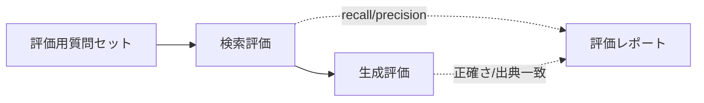
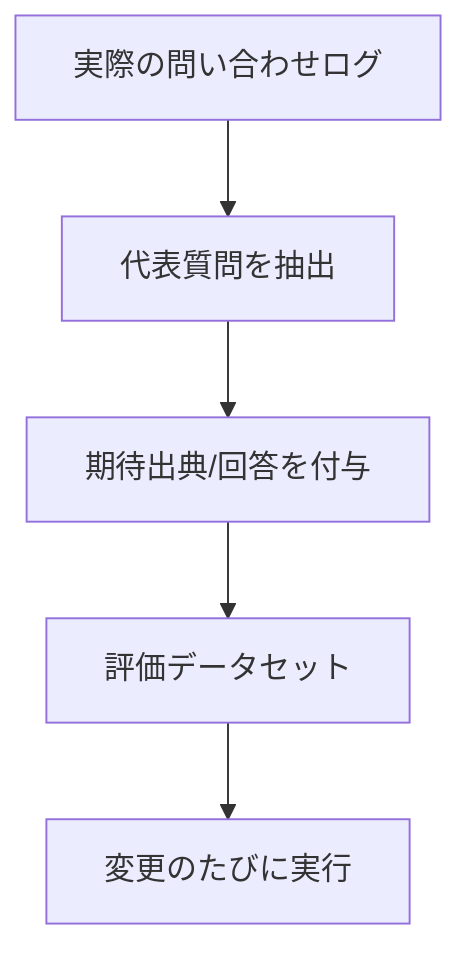
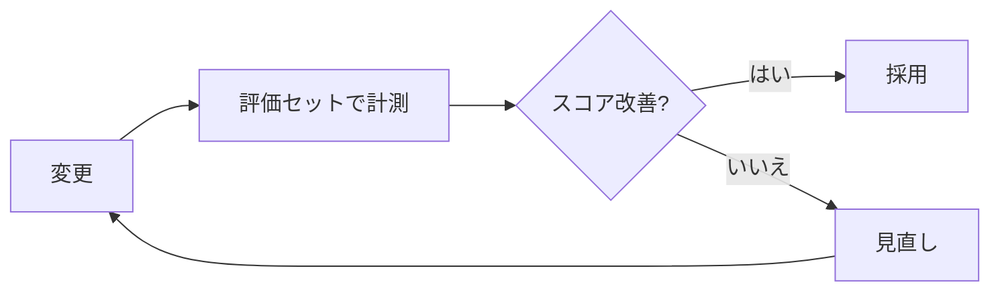

RAG は「検索」と「生成」を **分けて評価** すると改善点が特定しやすくなります。
評価なしの改善は当て推量になりがちで、「なんとなく良くなった気がする」から抜け出せません。

## なぜ分けて評価するのか

回答が悪いとき、原因は **検索（根拠が取れていない）** か **生成（根拠はあるが活かせていない）** の
どちらかです。分けて測れば、どこを直すべきかが一目で分かります。

## 検索の評価指標

| 指標 | 意味 |
| --- | --- |
| recall@k | 上位k件に正解文書が含まれる割合（取りこぼしの少なさ） |
| precision@k | 上位k件のうち関連文書の割合（ノイズの少なさ） |
| MRR | 正解が何番目に出るか（上位に来るほど良い） |
| nDCG | 順位を考慮した総合的な検索品質 |

まずは **recall@k** を重視します。検索で正解が取れていなければ、後段でどう頑張っても回答できません。

## 生成の評価指標

| 指標 | 見るもの |
| --- | --- |
| 忠実性（faithfulness/groundedness） | 回答が与えた根拠に基づいているか（幻覚していないか） |
| 回答の関連性 | 質問にちゃんと答えているか |
| 出典一致 | 提示した出典が回答内容と整合しているか |
| 幻覚率 | 根拠に無いことを言っていないか |

## 評価データセットの作り方

小さくても良いので、**代表質問 + 期待される正解出典/回答**のセットを用意します。

- まず **20〜50問**程度の小さなセットから始める（無いより圧倒的に良い）
- 実際の問い合わせログから代表例を選ぶと現実に即する
- 難問・エッジケース（情報が無い質問など）も入れる

## LLM-as-a-judge の注意

回答品質の採点は人手では回りません。**LLM に採点させる（LLM-as-a-judge）**のが現実的ですが、注意があります。

- **採点基準を明文化**する（曖昧な「良い/悪い」では揺れる）
- 判定モデルのバイアス（長い回答を高評価しがち等）に注意
- 重要な判定は人手でスポット検証してキャリブレーションする

## 運用: 回帰を防ぐ

評価は一度きりではなく、**変更のたびに回す**ことで効果を発揮します。

- チャンク・検索・プロンプト・モデルを変えたら、評価セットでスコアを比較
- スコアが下がる変更は採用しない（回帰検知）
- **オフライン評価**（データセットで事前検証）と **オンライン評価**（本番のフィードバック・正答率）を併用

## テックリードが訊いてくる質問

> **Q. 「評価データを作る時間がない」**
> A. 20問でも始める価値があります。無いと改善が当て推量になり、結局もっと時間を失います。

> **Q. 「検索と生成、どっちから直す？」**
> A. まず検索（recall@k）。正解が取れていないなら生成側をいじっても直りません。

> **Q. 「LLM採点は信用できる？」**
> A. 基準を明文化し、人手でスポット検証すれば実用十分です。ただし判定モデルのバイアスは前提に置きます。

> **Q. 「コスト最適化したら精度が落ちないか心配」**
> A. だからこそ評価が要ります。キャッシュ・モデル切り替え（[最適化](/ai-tech-notes/cost-roi/optimization/)）の前後でスコアを比較します。

> **Q. 「本番で効いているかは？」**
> A. オフライン評価に加え、本番の正答フィードバック・解決率などオンライン指標も追います。
