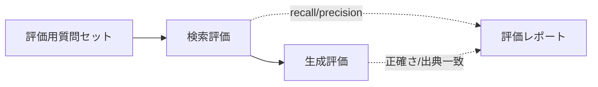

RAG は「検索」と「生成」を **分けて評価** すると改善点が特定しやすくなります。
評価なしの改善は当て推量になりがちです。

## 2層で評価する

| 層 | 指標 | 見るもの |
| --- | --- | --- |
| 検索 | recall@k / precision@k | 正解文書を取れているか |
| 生成 | 正確性 / 出典一致 / 幻覚率 | 根拠に沿った回答か |

## 実務的なやり方

- 代表質問 + 期待出典の **評価データセット** を小さく作る
- LLM-as-a-judge で回答品質を自動採点（基準を明文化）
- 変更（チャンク/検索/プロンプト）ごとにスコアを比較

:::note[今後追記]
評価データセットの作り方と、判定プロンプトの例を追加予定。
:::
