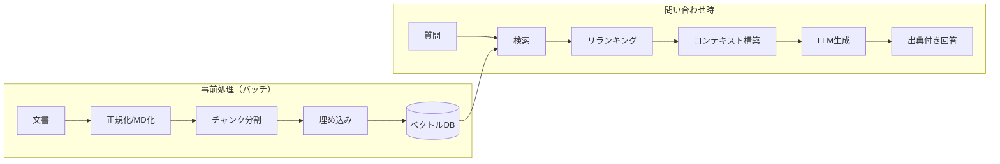
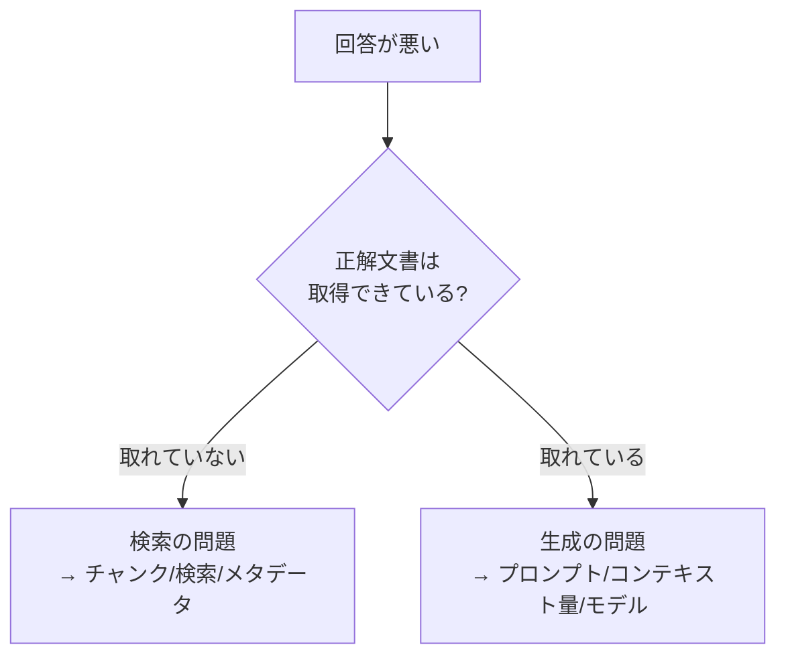

RAG（Retrieval-Augmented Generation, 検索拡張生成）は、
LLM に **外部ナレッジを検索して根拠として与える** ことで、
最新性・正確性・出典提示を実現する手法です。高精度なナレッジ回答の中核になります。

なぜ必要かは [LLM の基礎](/ai-tech-notes/llm-basics/) が出発点です。LLM は
「知っていること」ではなく「もっともらしい続き」を生成し、学習時点までの知識しか持ちません。
だからこそ、社内文書を**根拠として検索して渡す**ことが、幻覚を抑え、出典を示す鍵になります。

## 基本パイプライン

RAG は大きく **「事前処理（インデックス構築）」** と **「問い合わせ時（検索→生成）」** の
2フェーズに分かれます。事前処理の品質が、問い合わせ時の精度を上限として決めます。

## RAG / ファインチューニング / 長文投入 の使い分け

「社内知識を使わせたい」ときの選択肢は RAG だけではありません。混同されがちなので整理します。

| 手段 | 何をする | 向くケース | 注意 |
| --- | --- | --- | --- |
| **RAG** | 検索して根拠を都度渡す | 更新が多い・出典が要る・大量文書 | 検索精度の作り込みが必要 |
| **ファインチューニング** | モデル自体を追加学習 | 口調・形式の固定、特定タスク最適化 | 知識の更新に弱い・コスト大・幻覚は消えない |
| **長文をそのまま投入** | 文書を丸ごとコンテキストへ | 文書が少なく小さい | 大量だとコスト増・精度低下（[コンテキスト](/ai-tech-notes/llm-basics/context-window/)） |

:::tip
「最新の社内知識に基づく正確な回答」が目的なら、まず **RAG** が第一選択です。
ファインチューニングは**知識の注入ではなく振る舞いの調整**に使うのが基本です。
:::

## 精度を決める4要素

RAG の精度は、次の4要素でほぼ決まります。どれか1つだけ頑張っても頭打ちになります。

| 要素 | 効くポイント | 詳細 |
| --- | --- | --- |
| チャンク戦略 | 検索ヒットの粒度 | [チャンク戦略](/ai-tech-notes/rag/chunking/) |
| 検索方式 | 再現率・適合率 | [検索とリランキング](/ai-tech-notes/rag/retrieval/) |
| メタデータ | 絞り込みの効き | [メタデータ](/ai-tech-notes/data-modeling/metadata/) |
| 評価 | 改善サイクル | [評価](/ai-tech-notes/rag/evaluation/) |

## LLM はステートレス、という大前提

RAG を設計するうえで外せない前提が、**LLM は記憶を持たない（ステートレス）**ことです。
取得した文書も会話履歴も、**毎回コンテキストに載せて再送**する必要があり、これがコストに直結します。
キャッシュでこの挙動がどう変わるか（そしてモデルごとの違い）は
[コンテキストとキャッシュ](/ai-tech-notes/rag/context-and-caching/) で詳しく扱います。

## 典型的な失敗と切り分け

「RAG なのに精度が出ない」ときは、**検索**と**生成**のどちらが原因かをまず切り分けます。

| 症状 | 疑う場所 | 主な対策 |
| --- | --- | --- |
| 関連文書がそもそも出てこない | チャンク・検索 | [チャンク戦略](/ai-tech-notes/rag/chunking/) / [ハイブリッド検索](/ai-tech-notes/rag/retrieval/) |
| 取れているのに回答が薄い・的外れ | プロンプト・投入量 | コンテキスト構築・指示の見直し |
| 古い情報で答える | データ鮮度 | [重複バージョン対策](/ai-tech-notes/anti-patterns/data-duplication/) |
| 出典がズレる | チャンクのメタデータ | 見出しパス・doc_id の付与 |
| コストが高い | 投入トークン量 | 絞り込み・[キャッシュ](/ai-tech-notes/rag/context-and-caching/) |

## テックリードが訊いてくる質問

> **Q. 「RAG とファインチューニング、どっちでやる？」**
> A. 知識の鮮度・出典が要るなら RAG。口調や出力形式の固定はファインチューニング。多くの社内ナレッジ用途は RAG が本命です。

> **Q. 「精度が出ないのはモデルが弱いから？」**
> A. まず検索品質を疑います。正解文書が取れていないなら、より賢いモデルに変えても直りません。検索→生成の順で切り分けます。

> **Q. 「評価はどうやる？“なんとなく良くなった”は困る」**
> A. 検索（recall/precision）と生成（出典一致・幻覚率）を分けて計測します（[評価](/ai-tech-notes/rag/evaluation/)）。変更のたびにスコアを比較します。

> **Q. 「権限のない文書が回答に混ざらない？」**
> A. 検索段で**アクセス権限でフィルタ**するのが前提です（[検索](/ai-tech-notes/rag/retrieval/)）。元システムの権限を索引にも反映します。

## RAG と MCP の関係

RAG は「事前にインデックス化した知識を検索」、MCP は「実行時に外部システムへ問い合わせ」が得意です。
両者は競合せず補完関係にあります → [RAG と MCP の使い分け](/ai-tech-notes/mcp/rag-vs-mcp/)。

:::note[このセクションの読み方]
[チャンク戦略](/ai-tech-notes/rag/chunking/) → [検索とリランキング](/ai-tech-notes/rag/retrieval/) →
[評価](/ai-tech-notes/rag/evaluation/) → [コンテキストとキャッシュ](/ai-tech-notes/rag/context-and-caching/)
の順に読むと、構築から運用・コストまで一通り押さえられます。
:::
