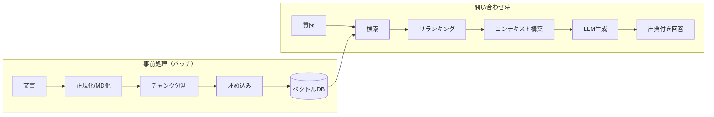

RAG（Retrieval-Augmented Generation, 検索拡張生成）は、
LLM に **外部ナレッジを検索して根拠として与える** ことで、
最新性・正確性・出典提示を実現する手法です。高精度なナレッジ回答の中核になります。

## 基本パイプライン

## 精度を決める4要素

| 要素 | 効くポイント | 詳細 |
| --- | --- | --- |
| チャンク戦略 | 検索ヒットの粒度 | [チャンク戦略](/ai-tech-notes/rag/chunking/) |
| 検索方式 | 再現率・適合率 | [検索とリランキング](/ai-tech-notes/rag/retrieval/) |
| メタデータ | 絞り込みの効き | [メタデータ](/ai-tech-notes/data-modeling/metadata/) |
| 評価 | 改善サイクル | [評価](/ai-tech-notes/rag/evaluation/) |

## RAG と MCP の関係

RAG は「事前にインデックス化した知識を検索」、MCP は「実行時に外部システムへ問い合わせ」が得意です。
両者は競合せず補完関係にあります → [RAG と MCP の使い分け](/ai-tech-notes/mcp/rag-vs-mcp/)。

:::note[今後追記]
GraphRAG / HyDE / クエリ拡張など発展的手法を追加予定。
:::
