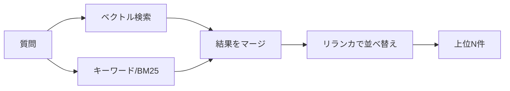

検索段は「**取りこぼさない（再現率）**」と「**ノイズを入れない（適合率）**」の両立が目標です。
ベクトル検索とキーワード検索のハイブリッド + リランキングが定石です。

## ハイブリッド検索

- **ベクトル検索:** 意味的な近さに強い（言い換えに強い）
- **キーワード検索:** 固有名詞・型番・略語に強い
- **リランキング:** クロスエンコーダ等で精度の高い並べ替え

## チューニングの勘所

| パラメータ | 効果 |
| --- | --- |
| top_k（一次取得数） | 大きいほど再現率↑・コスト↑ |
| リランク後の件数 | 小さいほど適合率↑・幻覚↓ |
| メタデータフィルタ | 部署・期間で対象を限定 |

- 一次検索は広め、リランク後は **絞ってからLLMへ** がコスト最適 → [最適化](/ai-tech-notes/cost-roi/optimization/)

:::note[今後追記]
リランカ選定（API/ローカル）とコスト比較を追加予定。
:::
