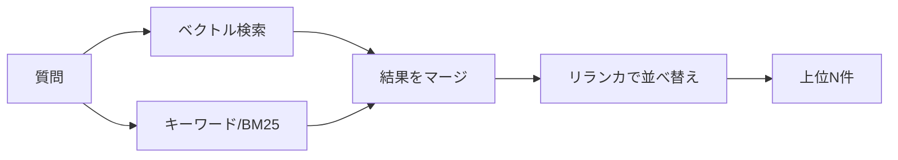
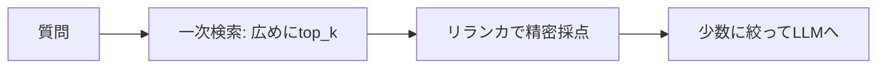
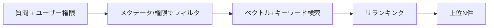

検索段は「**取りこぼさない（再現率）**」と「**ノイズを入れない（適合率）**」の両立が目標です。
ベクトル検索とキーワード検索のハイブリッド + リランキングが定石です。

## 再現率と適合率

| 指標 | 意味 | 低いと起きること |
| --- | --- | --- |
| 再現率（recall） | 正解文書を取りこぼさない度合い | 答えが文脈に無く、回答できない/幻覚 |
| 適合率（precision） | 取得結果に無関係が混ざらない度合い | ノイズで回答が薄まる・コスト増 |

戦略は **「一次検索は広めに取って再現率を確保し、リランキングで絞って適合率を上げる」** が基本です。

## ハイブリッド検索

- **ベクトル検索:** 意味的な近さに強い（言い換え・同義に強い）。固有名詞や型番には弱いことがある
- **キーワード検索（BM25等）:** 固有名詞・型番・略語・エラーコードに強い。言い換えには弱い
- **ハイブリッド:** 両者を併用し、互いの弱点を補う。結果のマージには RRF などの手法が使われる

:::tip
日本語の社内文書は、製品名・社内用語・略語が多く、**キーワード検索の併用が効きます**。
ベクトル検索だけだと固有名詞の取りこぼしが起きがちです。
:::

## リランキング

一次検索で広めに取った候補を、より精度の高いモデルで**並べ替え**ます。

- **クロスエンコーダ型リランカ**は、質問と各文書を一緒に評価するため精度が高い
- 一次検索（高速・粗い）→ リランク（低速・高精度）→ 上位を厳選、の二段構えが定石
- リランク後に **LLM へ渡す件数を絞る**ことで、適合率↑・幻覚↓・コスト↓

## クエリ変換（取りこぼしを減らす）

ユーザーの質問そのままでは検索に弱いことがあります。検索前にクエリを加工する手法群です。

| 手法 | 内容 |
| --- | --- |
| クエリ拡張 | 同義語・関連語を足して再現率を上げる |
| マルチクエリ | 質問を複数の言い換えに展開し、結果を統合 |
| HyDE | 仮の回答を生成し、その埋め込みで検索する |
| 会話の文脈解決 | 「それ」「前の件」などの指示語を具体化してから検索 |

注意: これらは LLM 呼び出しを増やすため、**精度向上とコスト/レイテンシのトレードオフ**を評価します。

## メタデータフィルタと権限フィルタ

検索は「意味の近さ」だけでなく、**メタデータでの絞り込み**と併用すると精度が大きく上がります。

- **メタデータフィルタ:** 部署・期間・文書種別で対象を限定（[メタデータ](/ai-tech-notes/data-modeling/metadata/)）
- **権限フィルタ（重要）:** 閲覧権限のない文書を検索結果から除外する。
  元システム（[データソース](/ai-tech-notes/data-sources/)）の権限を索引に反映し、ユーザーごとに絞り込む

:::caution[権限の取りこぼしは情報漏えい]
権限フィルタを後付けにすると事故ります。**検索の段階で権限を効かせる**設計を最初から入れます。
:::

## チューニングの勘所

| パラメータ | 効果 |
| --- | --- |
| top_k（一次取得数） | 大きいほど再現率↑・コスト↑ |
| リランク後の件数 | 小さいほど適合率↑・幻覚↓ |
| メタデータフィルタ | 対象を限定して精度↑ |
| スコア閾値 | 関連が薄い候補を足切り |

- 一次検索は広め、リランク後は **絞ってからLLMへ** がコスト最適 → [最適化](/ai-tech-notes/cost-roi/optimization/)
- 取得文書はクエリ毎に変わるため、**プロンプトキャッシュは効きにくい**点に注意（[コンテキストとキャッシュ](/ai-tech-notes/rag/context-and-caching/)）

## テックリードが訊いてくる質問

> **Q. 「ベクトル検索だけでいいのでは？」**
> A. 固有名詞・型番・略語の取りこぼしが起きます。日本語の社内文書ほどキーワード検索の併用が効きます。

> **Q. 「top_k は大きくすれば安心？」**
> A. 再現率は上がりますが、ノイズとコストが増え、リランクしないと適合率が下がります。広く取って絞るのが原則です。

> **Q. 「リランカは必須？コストが気になる」**
> A. 精度対コストが良い投資です。専用リランカは LLM 生成より安価で、適合率向上で幻覚も減ります。まず効果を計測します。

> **Q. 「ユーザーごとに見える文書が違う。どう担保する？」**
> A. 検索段で権限フィルタを必須にします。元システムの権限をメタデータに反映し、クエリ時にユーザー権限で絞ります。

> **Q. 「検索を変えたら良くなった気がする、を卒業したい」**
> A. recall@k / precision@k を評価データで計測し、変更前後を比較します（[評価](/ai-tech-notes/rag/evaluation/)）。
