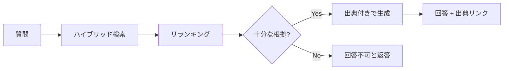

社内に分散したナレッジを横断し、**出典付きで正確に回答**するユースケースです。
幻覚（hallucination）の抑制と、根拠提示が最優先になります。

## 要件

- 回答には必ず **出典（ソース文書・該当箇所）** を添える
- 情報が無い場合は「分からない」と返す（捏造しない）
- アクセス権限を尊重する（権限のない文書を回答に混ぜない）

## 典型フロー

## 精度を上げる勘所

- **チャンク設計** が回答精度を大きく左右する → [チャンク戦略](/ai-tech-notes/rag/chunking/)
- **メタデータ**（部署・更新日・文書種別）で検索を絞る → [メタデータ](/ai-tech-notes/data-modeling/metadata/)
- 古い版が混ざると精度低下 → [重複バージョン対策](/ai-tech-notes/anti-patterns/data-duplication/)

:::note[今後追記]
出典提示のUIパターン、権限フィルタの実装方法を追加予定。
:::
