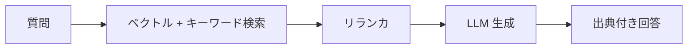

ユースケースごとに推奨する構成パターンを示します。
いずれも [全体像](/ai-tech-notes/overview/architecture/) の部分集合です。

## 回答 Q&A 向け（精度・出典重視）

- 重視: 検索精度とリランキング
- 補足: コンテキストは絞り、コストと幻覚を抑える

## ドラフト作成向け（文脈量重視）

- テンプレート + 関連文書を広めに投入
- セクション分割生成でコンテキスト/コストを制御
- 必要に応じて [MCP](/ai-tech-notes/mcp/) で外部データを都度取得

## レビュー支援向け（基準駆動）

- 基準ドキュメントを RAG で参照
- 対象データの所在に応じて [GitHub](/ai-tech-notes/data-sources/github/) / [Confluence](/ai-tech-notes/data-sources/confluence/) と連携

## 選定早見表

| 観点 | 回答 | ドラフト | レビュー |
| --- | --- | --- | --- |
| 検索精度 | ◎ | ○ | ○ |
| コンテキスト量 | 小 | 大 | 中 |
| MCP の出番 | 小 | 中 | 中〜大 |
| コスト感 | 低〜中 | 中〜高 | 中 |

:::note[今後追記]
規模別（PoC/部門/全社）の構成と、コンポーネント選定の根拠を追加予定。
:::
